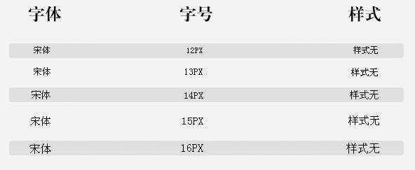
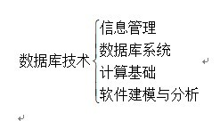
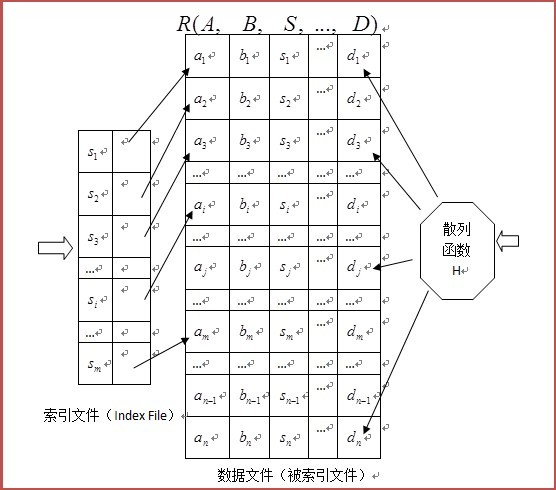

# IT俱乐部项目培训计划IV  
# The Training Planning at Project Of IT Association 
***
制定：李颖豪/千木郷
E-mail: chigix@zoho.com
微博：http://weibo.com/chigix

官方微博：http://weibo.com/itasso 

***
#### ★模块进度：

<table>
  <tr>
    <th>模块名</th>
    <th>书籍材料</th>
  </tr>
  <tr>
    <td>PhotoShop应用与设计</td>
    <td>本手册</td>
  </tr>
  <tr>
    <td>HTML+CSS</td>
    <td>《CSS网站布局实录》 <a href="http://w3.org">http://w3.org</a></td>
  </tr>
  <tr>
    <td>GIT团队协作与版本控制</td>
    <td>本手册 <a href="https://www.github.com">https://www.github.com</a> <a hrref="https://www.gitshell.com/">https://www.gitshell.com/</a></td>
  </tr>
  <tr>
    <td>jQuery</td>
    <td>《jQuery权威指南》 <a href="http://jquery.com">http://jquery.com</a></td>
  </tr>
  <tr>
    <td>PHP+MySQL基础</td>
    <td>《PHP语言精萃》 <a href="http://php.net">http://php.net</a></td>
  </tr>
  <tr>
    <td>ThinkPHP项目实战</td>
    <td>《ThinkPHP完全开发手册》 <a href="http://thinkphp.cn">http://thinkphp.cn</a></td>
  </tr>
  <tr>
    <td>网站企划</td>
    <td>本手册</td>
  </tr>
</table>
在此对Sina @ThinkPHP @luofei614 @gitshell 的支持与关注表示感谢。 
其中，所有的教学用库均由gitshell.com提供项目全程托管服务，关于GIT的资料及支持亦来自@gitshell。

***
### 目录  

##### [模块一 PhotoShop应用与设计](#photoshop)

1. [软件概述与PhotoShop速成](#ps1)
* [PhotoShop工具栏](#ps2)
* [PhotoShop常用面板](#ps3)
* [面向对象的UI元素设计](#ps4)
* [PhotoShop网页布局上的应用](#ps5)

##### 模块二 HTML+CSS
    
1. XHTML与非布局CSS基础
* Aptana Studio
* DOM对象与Chrome浏览器的元素考察器
* 文档流与CSS布局基础
* 绝对定位布局
* 相对定位布局
* CSS中的滑动门技术
* 结构化的CSS设计与OOD
* HTML标签多样化使用
* 静态登录设计
    
##### 模块三 GIT团队协作与版本控制
    
1. 网络与服务
    
##### 模块四 jQuery

1. 逻辑代数
* 逻辑算法入门与数学建模
* JavaScript快速入门
* jQuery与OOP
* jQuery简单动画
* jQuery高阶动画
* jQuery的DOM操作
* jQuery插件系统
* jQuery基本事件
* jQuery高级事件
* jQuery-UI插件
* Chrome/Webkit前端调试器
* 浏览器骇客

##### [模块五 PHP+MySQL基础](#php)

1. [现代B/S软件架构与Linux](#php1)
* [Apache服务器配置与脚本语言学习概述](#php2)
* [PHP基本语法](#php3)
* [PHP中的变量](#php4)
* [PHP变量作用域](#php5)
* [预定义变量](#php6)
* [PHP运算符](#php7)
* [时间戳](#php8)
* [PHP函数](#php9)
* [PHP与OOP](#php10)
* [PHP的OOP编程](#php11)
* [MySQL的CURD操作](#php12)
* [数据库设计](#php13)
* [应用逻辑与触发器](#php14)
* [数据库加锁协议与索引设计](#php15)
* [PHP中的MySQL连线](#php16)
* [COOKIE、SESSION操作](#php17)
* [PCRE模式](#php18)
* [XML速成](#php19)
* [XML解析类设计](#php20)
* [静态登录实现](#php21)

##### 模块六 ThinkPHP项目实战

1. 三大架构与MVC框架
* 基于UML的blog系统分析
* 前后端COOKIE、SESSION配合
* 乐观锁：版本控制机
* PHP中的MVC设计
* ThinkPHP网站速建
* ThinkPHP视图渲染
* ThinkPHP中的CURD操作
* ThinkPHP高阶查询
* ThinkPHP数据库应用逻辑
* ThinkPHP控制器设计
* ThinkPHP控制器实战
* ThinkPHP调试
* AJAX原理与简单实践
* AJAX前端高阶调试
* AJAX动态登录
* AJAX前后端交互
* ChromePHP调试类
* ThinkTemplate模板引擎
* ThinkPHP内核骇客
* ThinkPHP项目实战（1周）

##### 模块七 网站企划
1. SEO介绍
* Google Analytics流量分析
* 用Visio规划网站构架图
* 网站的基本规则
* 企划书的前置作业
* 建构网站前的制作要点
* 购物网站的概念
* 制作网站企划书
* 网页版面设计
* 购物车系统
* 域名、服务器、带宽和技术支持
* 网站推广与搜索引擎收录
* 用VISIO设计网站版面雏形

***
<h2 id="photoshop">模块一  PhotoShop应用与设计</h2>

<h3 id="ps1">1.1  软件概述与PhotoShop速成</h3>
#### ★应用软件共有特点：

所有的应用软件，其所有功能一般均会在其菜单栏上完全放置。  
由于所有的操作命令都须从菜单栏上去调用，对于一些常用命令的使用带来不便，故每个软件都设有自己的一套快捷操作体系，如右键快捷菜单、Office 2007风格的RIBBON样式菜单、两边侧边快捷工具栏，底部的快捷工具栏等。  
  
Word 2010的菜单栏、工具栏分布

  
PhotoShop中的菜单栏、工具栏分布

  
MathType中的菜单栏、工具栏分布

#### ★了解photoshop的界面

在阅读本节之前我相信您已经下载并安装了photoshop，一切准备就绪后  
打开你的photoshop让我们开始学习吧！  
本节课程主要让你了解photoshop的构造以便更容易的学会此软件。  
**Photoshop的工作区**  
Ps的工作区由下面的组建构成（参考图一，如果图片显示略小您可以打开您自己的photoshop对照阅读）  

**菜单栏：**相信在您已经发现了photoshop的菜单栏和您曾经用过的软件十分相似，它在photoshop的顶部并且包含了工种各样的菜单选项。  

**工具栏：**默认情况下工具栏在photoshop窗口的左边，这里包含了处理图像的各种工具，就好像女孩子的化妆盒一样。：）  

**控制面板：**控制面板在菜单栏的下面，这里会显示当前所选工具的选项，您可以随见点选工具栏的图标观察控制面板的变化来理解控制面板的作用。  

  
图1  

**面板组:**一般它在photoshop的右上角，面板组会显示不同功能的面板。就好像画画时候使用的调色板一样可以把颜色挤在上面，但是作为软件添加在上面的是功能。  

**工作区切换器：**一般它在photoshop的右上角点选工作区切换器可以改变面板组的组合，方便您对不同的项目进行设计。  

**文档窗口：**它在photoshop的中心位置，您导入的图片或者新建的图片就会存在于文档窗口，您对图片的操作都会在这里进行。  

#### ★何谓图层
  
#### ★色彩基础
了解颜色  
了解如何创建颜色以及如何将颜色相互关联可以让您在photoshop，Illustrator或者CAD等设计软件中更有效率的工作。由于您了解基本颜色理论，您将能够生成理想结果，而不是偶然获得某种效果。
 
原色  
加色原色是指三种光色（红，绿，蓝），当按照不同组合将这三种光色添加在一起时，可以生成可见色谱中的所有颜色。添加等量红色、蓝色和绿色光可以生成白色。完全缺少红色。蓝色和绿色光将导致生成黑色。计算机的显示器是使用加色原色创建颜色的设备。  
  
加色（RGB）  
R：红色G：绿色B：蓝色  
减色原色是指一些颜料，当按照不同组合将这些颜料添加在一起时，可以创建一个色谱。与显示器不同，打印机使用减色原色（青色、洋红色、黄色、黑色） 并通过减色混合来生成颜色。使用“减色”这个术语是因为，这些原色都是纯色，将他们混合在一起后生成的颜色都是原色的不纯版本。例如：橙色是通过将洋红色 和黄色进行减色混合创建的。  
   

C：青色M：洋红Y：黄色K：黑色
 
色轮
如果您是第一次调整颜色分量，在处理色彩平衡时手头有一个标准色轮图表会很有帮助。可以使用色轮来预测一个颜色分量中的更改如何影响其他颜色，并了解这些更改如何在RGB和CMYK颜色模型之间转换。  
  
色轮
R：红色Y：黄色G：绿色C：青色B：蓝色M：杨红
 
例如：通过增加色轮中相反颜色的数量，可以减少图像中某一颜色的数量，反之亦然。在标准色轮上，处于相对位置的颜色被称作补色，同样，通过调整色轮中两个相邻的颜色，甚至将两个相邻的色彩调整为其相反的颜色，可以增加或减少一种颜色。  

在CMYK图像中，可以通过减少洋红色数量或增加其互补色的数量来减淡洋红色，洋红色的互补色为绿色（在色轮上位于洋红色的相对位置）。在RGB图像中，可以通过删除红色和蓝色或通过添加绿色来减少洋红色。所有这些调整都会得到一个包含较少的整体色彩平衡。

<h3 id="ps2">1.2  PhotoShop工具栏</h3>

工具栏是photoshop重要的组件。  

**解析photoshop工具栏**  
  

工具栏在photoshop中分成了4个独特的类别所以找到合适的工具是不困难的。这些分类是：  

**选择，剪切，切片和辅助工具**  
**修饰和绘制工具**  
**钢笔和文字工具**  
**3D和观察工具(不同版本略有不同)**  

除了这4个区域之外还有其他一些组件组成了工具栏，比较明显的就是前景色和背景色。（如图）  
现在你了解了工具栏的结构，让我们来看一下photoshop都提供了那些重要的工具。这里只是粗略的讲解工具栏，我们将在单独的章节中细致的了解photoshop提供的每一个工具。  

  

**选区工具：**用于选择对象，比如矩形，正方形和椭圆。  

**移动工具：**用来移动选区，对象和图层。  

**索套工具：**这几个索套工具被用于创建不规则图形选区。多边形索套工具用于创建多边形选区，磁性索套工具被用于自动跟踪对象的边缘。  

魔术棒工具只需要点击一下就能选择一个颜色相似的区域（比如上图中云彩白色的部分）。  

Q：什么是选区？  

A：选区用于分离图像的一个或者多个部分。通过选择特定的区域，您可以编辑效果和滤镜并将其应用于图像的局部，同时保持未选定区域不会被改动。上图中虚线区域即为选区。  

Q：本文对象指的是什么？  

A：本文所指的对象是人眼能分辨出的目标图像。  
这个对象可以在一个图层或多个图层内，又或者在选区内。  

  

**剪切工具：**剪切工具允许用户重新调整他们的图像区域，但是不能调整整个图像，它有点类似于用一把剪刀从一个图层上剪切出一小部分。  

**修复工具：**  

  

在photoshop的修复工具用来修复图像残缺，污点和红眼。  

Q：什么是红眼？ 

  

A：这是一个摄影术语，这个术语用于针对人物拍摄，当闪光灯照射到人眼的时候，瞳孔会放大让更多光线通过，视网膜的血管会在照片上产生泛红现象。  

  

**仿制图章工具：**仿制图章工具是一种克隆工具，他可以将图像的一部分绘制到同一图像的另一个部分或绘制到具有相同颜色模式的任何打开的文档的另一部分。您也可以将一个图层的一部分绘制到另一个图层。仿制图章工具对于复制对象或去除图像中的缺陷很有用。  

  

**橡皮擦工具：**橡皮擦工具用于擦除图像，选区或者图层的部分区域。和现实中的橡皮效果十分相似  

  

**锐化工具：**用来锐化图像的边缘  

**模糊工具：**会使图像模糊  

**涂抹工具：**可以涂抹图像，就像使用手指涂抹一样。  

  

**减淡工具：**可以让图像的某些区域变亮。  

**加深工具：**可以让图像的某些区域变暗。  

**海绵工具：**通常会是图像某些部分变深或者冲淡稀释。  

**绘画工具**  

  

**画笔和铅笔工具**常常用来绘制图案，这些工具可以非常有效的绘画自定义图像。和现实中的笔刷或者铅笔的用法类似。  

  

**油漆桶工具**常常用来为图层，选区和带有纯色或者渐变的区域填充颜色。  

**矢量绘画和文字工具**

  

**文字工具**用来像图片中插入文字，并且可以像word一样定义字体的大小，字体类型，颜色等文字属性。  

**钢笔工具**常常用来创建简单的形状和路径并且可以做为矢量对象自由放大缩小。  

**形状工具**是矢量对象，它可以创建photoshop已经设定好的形状（比如：矩形，圆形，多边形，自定义形状）  

**前景色/背景色**  

  

景色和背景色可以自由设置，可以与油漆桶，画笔，文本等配合使用（通常默认使用前景色）就好像调色板上涂的颜色一样。通过这种方式用户很容易知道当前自己使用的颜色。我们可以通过点击右上角的箭头来切换前景色和背景色。  

**工具的使用技巧**  

这些工具在实际使用过程中要视情况而定，如果要使用工具只需要点击一次即可，有些工具右下角带有黑色三角表示它有更多工具，右击或者长按该工具即可切换。  

<h3 id="ps3">1.3  PhotoShop常用面板</h3>

1.**HSB调色面板**  

  

调出该面板：  
1. 选择“窗口”→“颜色”  
2. 在“颜色”面板的右上角有一个带三角形和三根横线的快捷小菜单按钮，点击它，选择“HSB”。  
HSB彩色模式：是将色彩分解为色调，饱和度及亮度通过调整色调，饱和度及亮度得到颜色和变化。  

2.**历史记录面板**  

3.**图层面板**  

4.**信息面板**  

<h3 id="ps4">1.4  面向对象的UI元素设计</h3>  

<h3 id="ps5">1.5  PhotoShop网页布局上的应用</h3>  

**网页布局流程讨论：**  

1. 规划网站
* 创建html模板及文件目录等
* 将网站分为若干个div网页基本布局
* 网页布局与div浮动等
* 网页主要框架之外的附加结构的布局与表现
* 页面内的基本文本的样式（CSS）设置
* 网站头部图标与LOGO部分的设计
* footer部分信息的表现设置
* 导航条的制作
* 解决IE浏览器的显示BUG  

**产品页面设计交流：**  

  

产品页面设计的方法更多不在制作技巧上，而更多在如何让产品变得好用和对功能诉求的满足上。  
也即，能用是有效的解决问题的基本能力。  
而需要作为前提的基本技术：  
1. 尺寸与栅格  
2. 显示与间距  
3. 色彩与质感  
4. 文字相关  

  

  

  

  

    

版式；色彩；质感为了指导用户如何操作界面，如哪里可链接可浏览，哪里可发出命令。  
在做界面之初，不妨用一些基础浏览器控件和系统默认控件样式去诠释功能。可以高效，使用者无理解和操作门槛，而且不存在浏览器兼容性差异问题且样式统一。  
但如果产品需要在差异化上有竞争力，单纯地能用就不能满足了。需要有产品气质和相对应的品质感产生。  

  

<h2 id="php">模块五  PHP+MySQL基础</h2>  

<h3 id="php1">5.1  现代B/S软件架构与Linux</h3>  

现代B/S软件架构体系：

  

Linux操作系统，以其稳定、可靠、高效、廉价以及开源等诸多的优点受到众多企事业用户的青睐。随着IBM、惠普以及Oracle等这些IT巨人们开始支持或开发他们自己的LINUX操作系统，目前许多大中型企事业的计算机服务器正在越来越多地转向LINUX操作系统。  
LINUX操作系统在服务器领域的领先地位在可以预见的将来会越来越明显。随之而来的是对LINUX系统管理和开发人员需求的不断增加，从而会吸引更多的人学习LINUX。但是目前学LINUX的人数与学习微软系统或JAVA的人数相比，可以说还是少的可怜。造成这种现象的原因主要有以下几点：  

1. LINUX的门槛较高，对初学者来说有一定的难度。  
2. LINUX的学习时间较长，因此对于想快速致富的人没有吸引力。  
3. 与微软系统相比，LINUX操作系统的安装比较复杂，所以实践环境的搭建比较困难。 

谈到LINUX，就不得不先谈到UNIX，因为LINUX是从UNIX发展而来的。LINUX本身也是UNIX系统大家族中的一员。毫无疑问，UNIX和LINUX在目前和可以预见的将来都是最有影响的计算机操作系统。UNIX和LINUX系统被广泛地应用到大中企业级服务器和WEB服务器上，它们已经成为当今的主流操作系统。  
至于什么是UNIX，它其实本身就是一个计算机操作系统，一个用来协调、管理和控制计算机硬件和软件资源的控制程序。UNIX操作系统是一个多用户和多任务操作系统。与Windows操作系统不同的是，Unix主要的用户界面是命令行界面，用户通过UNIX系统提供的命令来操作计算机系统。UNIX一共有大约250多个命令，但是常用的很少。Windows被称为用户友好的操作系统，因为普通用户很容易学习和使用。UNIX被称为程序员友好的操作系统，因为程序员可以方便地重新配置UNIX操作系统，使之适应于自己的工作环境。  
UNIX系统不但可以使用在大中型计算机、小型计算机、工作站上，随着微型机的功能不断提高和Internet的发展，UNIX（特别是LINUX）系统也越来越多地使用在微机上。例如时下火爆的苹果系列产品上使用的iOS操作系统、智能手机上使用的Android操作系统均为类UNIX（UNIX-Like）操作系统。UNIX得到企业的广泛应用的主要原因是该系统的功能强大、可靠性高、技术成熟、网络功能强大还有开放性好等特点。LINUX被广泛地应用于WEB服务器的另一个重要原因是其成本非常低廉，因为绝大多数LINUX软件都是免费的。  
所以以类UNIX系统为主平台而进行的编程开发，也都继承了UNIX的特性，即代码命令控制一切。所以MySQL、PHP、APACHE在控制和程序代码的编写上就几乎不涉及鼠标操作的问题，即可视化操作可以认为等于零。由于MySQL、PHP和APACHE最初就是为LINUX而开发的软件平台，所以他们与LINUX系统的兼容性最好。虽然现在已经将MySQL、PHP和APACHE移植到了Windows系统上，但他们本身还有很多强大功能在Windows系统上是受到限制的，而只有在LINUX中才能发挥他们最完整的效力。  
而对于UNIX平台引申出来的编程，这些开发语言中，都有一类非常强大而特殊的变量类型：时间戳（Time stamp）。20世纪60年代末，美国麻省理工学院、贝尔实验室和通用电气公司联合研发了一个叫做Multics的操作系统，但由于开发时规划的不到位，幻想与现实的差距，让贝尔实验室于1969年撤出Multics项目的开发。  
而当时的贝尔实验室中，只有一个开发者，Ken Thompson却继续为项目开发软件，后来在同时Dennis Ritchie的帮助下，两人领导一组开发人员开发一个新的多任务操作系统，这个系统包括命令解释器和一些实用程序，这个项目称为UNICS（Uniplexed Information and Computing System），以表示它源自Multics的同时又比它的前身更简单，后来这个名字被改为UNIX。而那个时候，正好是1970~1971年，后来在1971年Ritchie发明了C语言。于1973时，Thompson和Ritchie用C语言重写了原来用汇编编写的UNIX，从而让UNIX代码简洁紧凑、易移植、易读、易修改，为此后UNIX的发展奠定了坚实的基础。可以说，20世纪70年代，就是UNIX诞生的年代，所以现在就直接认为1970年1月1日0时0分0秒即为UNIX诞生大纪元，简称UNIX纪元。而时间戳，也就是计算目标时间距离UNIX纪元的秒数，通过时间戳，可以随意转化任何人类文明的时间表示方法，并可以彻底将一个人类文明中的时间这一抽象概念，表示成计算机认识的INT型数据。  
UNIX操作系统所秉持的设计理念的宗旨就是简单、通用和开放。为此它的设计原则包括如下几个方面：  

* 在UNIX系统中，所有的东西都是文件，其中也包括了硬件。这也让UNIX目录变得十分简洁：   

  

* 所有的操作系统配置数据都存储在正文文件中。因为正文文件是最通用的接口，许多UNIX操作系统应用程序都可以维护正文。以正文方式存储系统配置信息允许操作系统管理员轻松地将且配置信息从一台计算机移到另一台计算机。一般配置文件，也就是.inc文件，或都命名为config，包括在PHP编程中也一样，不同的模块都有一个自己的配置文件，一般就叫config.inc.php，放置在模块对应的App目录中。  
* 每一个操作系统命令或应用程序都很小，而且只完成单一的功能。在使用MVC框架来编写PHP程序时，也同时是通过许多个小控制器来组合成一套大型的应用程序。而控制器也就是我们平常所说的程序模块。  
* 避免使用俘获用户的接口。在UNIX操作系统中很少有交互（问答式）的命令。用户在UNIX系统上发出命令之后，命令在通常情况下可能产生输出或者产生错误信息或者什么也不产生。交互的特性留给了应用程序，如正文编辑器vi。  
* 可以将多个程序串接在一直来完成复杂的任务。UNIX操作系统的一个核心特性就是可以将一个程序的输出变成另一个程序的输入。这就使用户可以灵活地将许多小程序组合在一直来完成较大和较复的任务。 

UNIX操作系统本身还引起了不小的版权变革。GNU计划就是其产物。该计划的目标是创建一套完全自由的操作系统。GNU计划采用了部分当时已经可以自由使用的软件，例如TeX排版系统和X Windows视窗系统等。不过GNU计划也开发了大批其他的自由软件。  
为保证GNU软件可以自由地使用、复制、修改和发布，所有GNU软件都有一份在禁止其他人添加任何限制的情况下授予所有权利给斜体人的协议条款，GNU通用公共许可证（GNU General Public License, GPL）来达到这一目的。这也就是被称为“反版权”（Copyleft）的概念。  
1985年，Richard Stallman创立了自由软件基金会（Free Software Foundation）来为GNU计划提供技术、法律以及财政支持。尽管GNU计划大部分时候是由个人自愿无偿奉献，但FSF有时还是会聘请专业程序员帮助编写软件。当GNU计划开始逐渐获得成功时，一些商业公司开始介入开发和技术支持。其中最著名的就是之后被Red Hat兼并的Cygnus Solutions公司。  
到了1990年，GNU计划已经开发了的软件包括了一个功能强大的文字编辑器Emacs，C语言编译器GCC，以及大部分UNIX系统的程序库和工具。唯一没有完成的重要组件就是操作系统的内核。  
“自由软件”（Free Software）这一术语的定义为，对你，一个特定的用户，一个程序是自由软件，就意味着：  

1. 你有自由以任何目的来运行该程序  
2. 你有修改该程序满足自己需求的自由（为使该自由实际上可实施，你必须可接触源代码，因为没有源代码的情况下，在一个程序中做修改是非常困难的）  
3. 你有权利重新发布副件，既可以白送，也可以收到一定费用。  
4. 你有权利发布该程序修改过的版本，从而让其他人得利益于你的改进。  

由于“自由的”涉及自由，未涉及价格，卖事件与自由软件之间没有矛盾。事实上，卖事件的自由是至关重要的：收藏CD-ROMS上的自由软件对社团是重要的，同时出售它们是为自由软件发展筹集资金的重要方法。  
LINUX是一种类UNIX计算机操作系统，诞生于1991年的10月5日，其操作系统内核在GPL条款下发布，也就是说，LINUX是一款完全自由的操作系统，所以有许多公司愿意参与进去，从而发布出自己企业版本的LINUX操作系统。其中最著名的就是IBM公司的Red Hat和Google公司的Android。现在市场上，许多手机商家都纷纷改用Android系统，就是因为它易编程，易修改，而且Copyleft，也就相应产生了各种手机自己品牌的Android系统。  
LINUX用户往往比其他操作如微软Windows和Mac OS的用户更有经验。这些用户有时被称作“黑客”（hacker）或是“极客”（geek）。然而随着Linux越来越流行，越来越多的原厂委托制造（OEM）开始在其销售的计算机上预装上Linux操作系统，LINUX的用户中也有了普通计算机用户。  
另外LINUX是最受欢迎的服务器操作系统之一。LINUX也在嵌入式计算机市场上拥有优势、低成本的特性。使用LINUX的主要成本为移植、培训和学习的费用，早期由于会使用LINUX的人较少，这方面费用较高，但这方面的费用已经随着LINUX的日益普及和LINUX上软件越来越多、越来越方便而降低。  
LINUX作为较早的源代码开放操作系统，将引领未来软件发展的方向。基于LINUX开放源码的我，越来越多的大中型企业及政府投更多的资源来开发LINUX。现今世界上，很多国家逐渐把政府机构内部计算机转移到LINUX上，如中国的“龙芯”，这个情况还会一直持续。LINUX的广泛使用为政府机构节省了不少经费，也降低了对封闭源码软件潜在的安全性的忧虑。  

<h3 id="php2">5.2  Apache服务器配置与脚本语言学习概述</h3>  

**★服务器环境部署**  

在本套培训体系中，服务器环境部署建议大家直接使用整合包安装部署。因为整个服务器环境由Apache、PHP、MySQL三部分组成且彼此独立，如单独安装需自己手工配置参数，这对于新手来说实在不易，且对于我们整套项目培训计划来说意义也不大，所以在此直接建议大家使用网上现成的集成整合环境直接一步到位。当然如果大家感兴趣，可以单独联系你们的培训项目组长以进行自学。  
网上有许多整合包可供学习者直接安装部署服务器环境。其中phpnow和wamp都是不错的安装包。在此我们以PHPNOW项目作为我们的教程内容。因为PHPNOW的配置上比WAMP更到位，更能直接应用于商务型服务器。  
解压完毕后，将自动执行 Init.cmd 进行初始化动作。如 图-2 示：  
期间可能出现防火墙提示，请允许。  

  

图-2：Init.cmd 过程  

    

图-3：解除防火墙  

Init.cmd 十秒钟即可完成。全部完成后，将自动打开默认页。  
（如果没有，试试手动打开 http://127.0.0.1）  

  

图-4：搭建成功  

如果你只想搭建一个网站，上面的环境已经足够。很都时候我们需要开设多个独立的网站。例如论坛和主页分开、和朋友共享服务器等等。这时就要用到 虚拟主机 了。  
下面说说 PHPnow 虚拟主机的使用。很简单。  
双击执行 D:\PHPnow\PnCp.cmd （可能你的安装路径不是 D:\PHPnow），输入 2 后回车。  
按照提示输入新建虚拟主机信息。如 图-5 所示。  

    

图-5：开设虚拟主机  

输入完信息回车后，将自动重启 Apache 以便生效。  
然后访问刚才添加的域名，注意事先解析好域名指向你的服务器 IP。  
如果没有域名或者不会用，可以通过编辑 C:\WINDOWS\system32\drivers\etc\hosts 来使用“虚拟域名”。  
本例中的 bbs.test.com 就是在 “127.0.0.1 localhost” 的下一行添加一行 “127.0.0.1 bbs.test.com” 实现的。  

  

图-6：虚拟主机开设成功   

可能你还需要为每个虚拟主机分配 MySQL 数据库，下面介绍下如何使用 phpmyadmin 分配用户和数据库。  
打开 http://127.1/phpMyAdmin；用 root 登陆。  
然后点击 “权限”再点击 “添加新用户”。  
填写好新的 用户名 和 密码；  
选择第二项 “Create database with same name and grant all privileges”。  
其他的保持默认；需要提的是，全局权限可不要选，除非必要，否则全不选。  
点击 [执行] 即可完成。难明白就看看图吧。  

  

图-7：添加数据库用户。  

把刚才添加的用户名和密码交给用户即可。注意 root 拥有最高权限，不要轻易把密码交给别人。  
至此，服务器环境部署完毕。  
但是请注意，PHPNOW是仅能运行于32位系统平台上的软件，如需在64位系统上安装，则目前只能选择WAMP，因为WAMP有专门为64位系统设计制作的整合包。而在微软的64位系统上有微软的官方监测申明，PHPNOW项目兼容：  

  

**★结构化程序**  

在面向对象程序的设计概念尚未提出之前，我们只能利用结构化的方式来进行程序设计。   
结构化程序就是**将程序分割成各自独立的函数**，而它们都有各自的功能，**主程序只需调用它们**，来完成主要的工作。   
下面举一个未结构化与一个结构化的程序，并比较一下它们的区别：  

**未结构化程序**  

    <?php  
    $a = 0;  
    $b = 0;  
    $c = 0;  
    For ($i = 0;$i <= 10;$i ++)  
    {  
      $a = $a + $i;  
    }  
    For ($i = 20;$i <= 30;$i ++)  
    {  
      $b = $b + $i;  
    }  
     For ($i = 50;$i <= 100;$i ++)  
    {  
      $c = $c + $i;  
    }  
    //$a涓轰粠1鍒?10鐨勭粨鏋?  
    Echo $a;  
    Echo $b;  
    Echo $c;  
    ?>  

**结构化程序**  

    <?php  
    $a = 0;  
    $b = 0;  
    $c = 0;  
    Function add($start,$end)  
    {  
      Var $s = 0;  
      For($i = $start;$i <= $end;$i ++)  
      {  
        $s += $i;  
      }  
    }  
    $a = add(1,10);  
    $b = add(20,30);  
    $c = add(50,100);  
    //缁撴灉涓庡乏绋嬪簭鐩稿悓  
    Echo $a;  
    Echo $b;  
    Echo $c;  
    ?>  

使用结构化的程序设计，的确简化了编写程序的工作，也提高了程序的可维护性。但是，结构化程序设计在开发大型项目时，还是无可避免地碰到了其他的瓶颈。  
通常结构化程序设计专注于函数功能的开发，而往往忽略了功能所要处理的数据，因此这些要被处理的数据与功能在结构化的程序设计中是分离的关系，如果在开发大型项目，相对会复杂许多。  
如果数据与函数之间并没有关系存在，这时很容易发生错误，而且维护起来也很不方便。后来面向对象程序设计兴起后，便解决了结构化程序设计所面临的数据与功能分离的问题。  
  
**★脚本语言学习概述**  

简单地说，程序就是一个可以被运行的普通文件，这种从源代码都需要编译才能生成程序的过程称为编译，完成编译的工具就是编译器。  
当然并不是所有的源代码都需要编译才能生成可执行程序的，有些代码本身主是可执行的，一些翻译工具会在执行过程中将这些代码翻译成计算机可以理解的二进制代码，送给服务器，这些代码也是程序，而这个翻译工具称为“解释器”，被解释执行的程序常常称为脚本。  
一般来说，编译型程序语言几乎都是强变量定义语言，例如C、C++、JAVA。而解释型程序语言中有一部分为弱定义变量语言，如PHP、JavaScript。  

在此学习脚本语言以PHP和JavaScript作为阐述对象，一般学习可分为如下几个阶段：  
  
1. 基本结构语法的学习  
2. 函数学习  
3. 算法思想学习    
4. OOP学习  

而整个的基础的结构语法，结构语法是作为写程序的所有代码的基本结构。而核心则是函数，任何你想要做的功能一定是通过函数来帮助你。  
函数分为系统函数和自定义函数。其间的差别就在于你的能力，你能自己去办到去实现的，一般则可自己设计自定义函数，而自己已经无能为力的地方，如要通过代码去控制硬件、去连接Telnet，这些事情需要专业级的算法和程序的支持，显然自己无法做到，那就需要去查询系统函数库中是否有对这类函数的提供。  
对于系统函数的学习，其实可以认为是不用学习的，只要到用的时候去查询即可。  
函数的学习主要是从三个角度来思考：函数功能描述、输入参数、输出返回值。从这三个角度来评定一个函数，而对于使用者来说，无需去涉及函数内部的实现算法，只要看该函数的IO是否符合自己当前的需求。  

<h3 id="php3">5.3  PHP基本语法</h3>  

`<?php ?>`为一个php脚本块    
在支持简写的服务器上，可以使用`<? ?>`来开始和结束脚本块  
一般`<? ?>`来引用变量，简化网页代码。   
▼echo和print
php的两种输出文本的基础指令，两者基本完全等价，可互用。    
`<? echo "Hello";?>//输出Hello`   
`<? print "Hello"?>//echo`   
【注意】FALSE值在他们中不输出，而TRUE在他们中的输出为“1”。  
▼php中的注释  
使用`//`来编写单行注释    
使用`/* */`来编写大的注释块。    
▼引号和变量  
单引号`' '`，没有任何意义，不经任何处理直接拿过来。包括转义，在单引号下无效。  
双引号`" "`，php动态处理然后输出，一般用于变量。  
变量形态：  
True 真值  
False  假值  
例如：  

    $abc='my name is tom';  
    echo $abc;//结果是:my name is tom  
    echo '$abc'; //结果是:$abc  
    echo "$abc"; //结果是:my name is tom  
    
★实例：

    $is_no = '是';  
    echo "我{$is_no}不是天才";//输出“我是不是天才”  

▼php中的变量  
所有变量都以`$`符号开始，且必需有`$`符号，否则变量无效。  
设置变量的正确方法：  

    $var_name=value;  
    $txt="Hello World!";//字符串需用引号赋值   
    $number=16;//数字不用引号赋值   
  
注：PHP中变量名区分大小写，而函数名不区分大小写。  

<h3 id="php4">5.4 PHP中的变量</h3>  

见API手册    

<h3 id="php5">5.5 PHP变量作用域</h3>  

1. **局部变量**    
定义：在函数内部声明的变量称为局部变量，存储于本中  
特点：保存在栈中，速度快。  
价值：非常有用，其作用域仅在函数内部，不会对函数外部产生影响  

2. **函数参数**  
定义：存储于栈中  
传递：可按值，也可引用传递。  
特点：参数在函数退出时，会自动撤消，不会保存下来  

3. **全局变量**  
定义：可在程序的任何地方访问，存储于专用的全局存储区中  
特点：需要加上GLOBAL关键字作为标注。全局存储区中的变量均可以通过_GLOBAL数组访问。  
      
4. **静态变量**  
定义：存储于专用的静态存储区中  
特点：需要加上STATIC关键字作为标注。静态变量在函数退出时，不会丢失值，并且再次调用此函数时还能保留这个值。  

<h3 id="php6">5.6 预定义变量</h3>  

▼预定义变量：  
说明：PHP默认变量可以方便取得服务器或PHP本身的内部数据。  
 
**$GLOBALS**  
将当前程序中所有全局变量的名称放到一个数组中，并返回该数组。其中，以全局变量的名称为索引键。  
  
**$_SERVER**  
取得当前程序所执行的内面服务器环境的信息。  
例如：  
`$_SERVER["DOCUMENT_ROOT"]`  
则会返回网页所在目录。  

**$_GET**  
获取并使用GET方式所得到的变量值。  
详见API手册  
    
**$_POST**  
获取并使用POST方式所得到的变量值。  
详见API手册  

**$_COOKIE**  
获取并使用COOKIES方式所得到的值。  
详见API手册  
  
**$_FILES**  
获取并使用POST方式进行文件上传的变量值。  
详见API手册  
   
**$_ENV**  
取得当前执行环境的信息。  
例如：  
`_ENV["SCRIPT_FILE NAME"]`返回PHP的执行文件的信息。  

**$_SESSION**  
用于Session的处理。  
详见API手册  
  

<h3 id="php7">5.7 PHP运算符</h3>  

▼并置运算符  
并置运算符`.`用于把两个字符串值连接起来。  

    <?php  
     $txt1="Hello World";  
     $txt2="1234";  
     echo $txt1 . " " . $txt2;  
    ?>//输出Hello World 1234,其中两个变量之间插入了一个空格  

▼算数运算符  
`+`  Addition  加法运算，可用于▼【合并数组】    
`-`  Subtraction  减法运算    
`*`  Multiplication  乘法运算    
`/`  Division  普通除法运算   
`%`  Modulus    取余运算    
`++`  Increment  自加运算  
`--`  Decrement  自减运算  

▼赋值运算符  

<table>
<tr>
  <th>符号</th>
  <th>举例运算</th>
  <th>等价运算</th>
</tr>
<tr>
  <td>=</td>
  <td>x=y</td>
  <td>x=y</td>
</tr>
<tr>
  <td>+=</td>
  <td>x+=y</td>
  <td>x=x+y</td>
</tr>
<tr>
  <td>-=</td>
  <td>x-=y</td>
  <td>x=x-y</td>
</tr>
<tr>
  <td>*=</td>
  <td>x*=y</td>
  <td>x=x*y</td>
</tr>
<tr>
  <td>/=</td>
  <td>x/=y</td>
  <td>x=x/y</td>
</tr>
<tr>
  <td>.=</td>
  <td>x.=y</td>
  <td>x=x.y</td>
</tr>
<tr>
  <td>%=</td>
  <td>x%=y</td>
  <td>x=x%y</td>
</tr>
</table>

▼比较运算符   
`==`等于 is equal to  
`===` 严格等于——详细情况见下面说明。    
`!=` 不等于 is not equal to  
`>` 大于 is greater than  
`<` 小于 is less than  
`>=` 大于等于  is greater than or equal to  
`<=` 小于等于  is less than or equal to  
说明：   
严格等于：    
`==`只是值相等，而`===`是要求值和数据类型都相等。    
赋值`a=3`时，`a===3`成立，`a=='3.0'`成立，而`a==='3.0'`不成立。  
▼逻辑运算符  
`&&` and  且    
`||`  or  或    
`!`  not  对命题的否定`!(2==4)returns true`   
▼其他运算符      
`$` 变量符号    
`&` 变量的地址(加在变量前)    
`@` 不显示错误信息(加在表达式前)   
`->` 物件的方法或者属性   
`=>` 陈列的元素值    
`? :`  三元运算子(常用于判断语句)  

<h3 id="php8">5.8 时间戳</h3>  

在PHP中有专门的进行与时间有关的函数。  
接触时间就不得不解决时间戳，这在几乎在所有函数中都涉及。  
时间戳是一个事件的发生被电脑记录的时间。  
注意是被电脑记录的时间，而不是本身发生的时间。也就说，时间戳记录的是计算机时间。  
计算机时间与人类世界时间计算方法不同，PHP时间戳用的就是UNIX时间。  
UNIX纪元是1970年1月1日00:00:00。  
UNIX时间就是计算事件发生的时间距UNIX纪元的秒数，而这个数字就是PHP时间戳。如在1970年1月1日00:01:01发生的事件，其时间戳就是61。在计算机中，时间戳一般就是用来记录某事件发生的时间点。只不过用计算机自己的时间方式来表示。  

<h3 id="php9">5.9 PHP函数</h3>  

▼创建PHP函数    

    function writeMyName() {  
    echo "David Yang";  
    }//用于输出'David Yang'的函数  
    
注：  
1. 所有的函数都使用关键词“function()”来开始    
2. 命名函数，函数的名称以字母或下划线线开头    
3. 添加`{`，开始写入函数的代码  
4. 添加`}`，作为函数代码块的结束标志  

▼使用php函数    

    <? writeMyName();?>  
    
▼参数      

    function writeMyName($fname) {    
        echo $fname . " Yang. ";    
    }    
    
▼调用   

    <? writeMyName("John");?>//输出'John Yang.'    

▼返回值    

    //函数部分：  
    function add($x,$y) {  
        $total = $x + $y;  
        return $total;  
    }    
    //函数使用：  
    <? echo "1+16=" . add(1,16);?>    //输出'1+16=17'      
    
▼可变函数  
代码示例：  

    <?php  
      function foo(){  
          echo "In foo() \n";  
      }  

      function bar($arg = ''){  
          echo "In bar();argument was '$arg'.  \n";  
      }  

      //代替echo的字符串显示函数    
      function echoit($string){  
          echo $string;  
      }  

      //实际调用可变函数：    
      $func = 'foo';  
      $func();//实际上是调用foo函数，将输出“In foo”    

      $func = 'bar';  
      $func('test');//实际上是调用了bar函数，将输出“In bar();argument was 'test'”。  
      $func = 'echoit';  
      $func('test');//实际上是调用了echoit函数，将直接输出“test”。   
      ?>    
      
说明：   
* 如果一个变量名的后面有圆括号，形如$func()，则将执行与该变量的值相同的函数。  
该函数即是可变函数。   
* 可变函数用起来像函数指针，上面先定义一个函数列表，然后下面只要一个变量即可。  
通过给该变量赋不同的值，即可调用不同的函数。  
* 可变函数可用来实现包括回调函数、函数表在内的一些用途。   
注意：可变函数不能用于语言结构    

<h3 id="php10">5.10 PHP与OOP</h3>  

面向对象程序的常见名词：  
<table>
  <tr>
    <td>属性</td>
    <td>即对象里的变量数据</td>
  </tr>
  <tr>
    <td>方法</td>
    <td>即对象里的函数功能</td>
  </tr>
  <tr>
    <td>成员</td>
    <td>即类里所定义的变量与函数</td>
  </tr>
  <tr>
    <td><strong>类</strong></td>
    <td><strong>对象的定义，由用户自行定义的数据类型</strong></td>
  </tr>
  <tr>
    <td>对象</td>
    <td>类的实例</td>
  </tr>
</table>  

面向对象程序设计的3大特色：    

**继承（Inheritance）、多态（Polymorphism）、封装（Encapulation）**  

#### 继承：  

子类可通过继承父类的方式，取得父类所定义的属性与方法。  
一般来说，在父类中定义常用的属性与方法，而子类则只需要扩展父类所定义的属性及方法，就可使用这些特性了。  

#### 多态：    

子类继承父类后，用相同名称的函数功能取代原来父类的功能。    

#### 封装：    

将函数功能与数据包装起来，成为一个对象，并定义对象的接口，让对象以外的程序可以通过它所提供的接口，进行沟通的操作。  
对象以外的程序不需要知道对象内部是如何进行去处的，只须知道如何使用对象的接口来完成自己的工作即可。  
  
  

设计对象的开发人员日后在维护对象程序的时候，只要保持对象的接口不变，对象外部的程序则一样可以执行。   

<h3 id="php11">5.11 PHP的OOP编程</h3>  

**★范围解析操作符`::`**  
`::`即一对冒号，可以用于访问静态成员、方法和常量，还可以用于覆盖类中的成员和方法。    
当在类的【外部访问】这些静态成员、方法和常量时，必须使用类的名字。   
   
【调用举例】    

    <?php  
      class MyClass   
      {  
        const CONST_VALUE = 'A constant value';  
      }  
      class OtherClass extends MyClass  
      {  
        public static $my_static = 'static var';  
        public static function doubleColon()  
        {  
          echo parent::CONST_VALUE . "\n";  //self和parent是特殊关键字    
          echo self::$my_static . "\n";     //用于在类的内部对成员或方法进行访问  
        }  
      }  
      echo MyClass::CONST_VALUE;            //在类的外部使用    
    ?>  
    
【覆盖父类举例】   

    <?php  
      class MyClass  
      {  
        protected function myFunc()  
        {  
          echo "MyClass::myFunc()\n";  
        }  
      }  
      class OtherClass extends MyClass  
      {  
        //覆盖父类中的方法    
        public function myFunc()  
        {  
          //在子类覆盖的方法中可以调用已被覆盖的方法    
          parent::myFunc();  
          echo "OtherClass::myfunc()\n";  
        }  
      }  
      OtherClass::myFunc();  
    ?>  
    
**★定义类**  

在PHP中，类是一种变量类型的表现。  

    <?php
      class 类名  
      {
       var $a;
       function 函数名称(参数系列)  
       {函数内容}
      }  
    ?>  
    
在类中，可以定义独立的变量或函数。  
定义类的个别属性时，  
前面必须加PHP用来定义变量的`var`保留字，  
代表此变量是这个类的属性，并且可以直接设置初始值。  
定义功能函数的方法则与一般函数相同。  
【方法】->【成员】  
类的方法中，如果要**访问类中的属性**，必须利用下列的方式：  
//在这里，变量名称不需加"$"符号  
【$this->变量名称】  
注：以上方括号内的可整体看做一个变量，做PHP的一个普通变量使用。  
构造函数:详见下方的★【构造函数与析构函数】  
【member_class.php】  

    <?php  
     class member_class  
     {  
      var $name;  
      public $name_1;//以上两条等效  
      var $sex;  
      var $tel;  
      var $addr;  
      //构造函数  
      function member_class($t_name)  
      {  
        $this->name = t_name;  
      }  
      function checkpasw($username,$userpasw)  
      {••••••}  
     }  
    ?>  

注：  
不能将一个类的定义分割到多个文件中。也不能将一个类的定义分割到多个 PHP 块中，  除非该分割是在一个方法声明内部。  但是通常还是把一个类放在一个文件的一个PHP块中。  

**★类的属性**  
属性声明是由关键字`public`或者`protected`或者`private`开头，然后跟一个变量来组成。  
属性中的变量可以初始化，但是初始化的值必须是常数  
所以一般建议类的属性使用单纯声明，即声明的同时不对该属性进行赋值运算等操作。  
▼`var`关键字
若直接使用`var`声明属性，而没有`public`等访问控制，php会认为这个属性为`public`  
对于`public`、`private`这一部分详见★【访问控制】  
▼`static`关键字  
声明类成员或方法为`static`（静态），就可以直接访问而不用实例化。  
访问**类的静态属性**或**在静态方法里面**调用方法，必须使用范围解析符，不能使用`->`  

    <?php
      class Foo
      {
        public static $my_static = 'foo';
        public function staticValue()
        {
          return self::$mystatic;
        }
        public static function aStaticMethod()
        {
          //.......
        }
      }
      //方法调用
      print Foo::$my_static . "\n";       //静态属性正确调用
      Foo::aStaticMethod();               //静态方法正确调用
      $foo = new foo();
      print $foo->staticValue() . "\n";   //正常方法调用
      print $foo->my_static . "\n";       //错误调用
    ?>

<h4 id="class">▼类常量：</h4>    
在类中定义常量，常量的值始终保持不变。  
常量的值必须是一个定值，不能是变量、类属性或函数调用的结果。  
类常量的定义：  
`const TABLE_NAME = 'undefined';`  
注：在定义和使用常量的时候不需要使用 $ 符号。  
〓类常量的访问须使用范围解析符  
在类的内部访问使用`self::property`（property是属性的名字）  

**★声明对象**  
在定义完类之后，它还是一个抽象化的概念。  
若要使用类，必须在类之外利用new命令来声明一个新的对象  
【类外】->【成员】  
在类外，类内的可使用下列方式：  

`$a = $class->member_in_the_class`  

    <?php  
      $member = new member_class;  
      $a = $member->name;  
    ?>  

另外，$this只能使用在类本身之中，而在类外，只能使用新声明的对象来取得其中的成员如果调用类的文件与类文件分离，则在调用类的脚本程序中：  

【checkmember.php】

    <?php
      require "member_class.php";//载入含有member_class类的脚本源文件  
      $member = new member_class;  
      //调用member_class类中的chkpasw函数  
      $adopt = $member->chkpasw($username,$userpasw);  
      •••••••  
     ?>  

<h4 id="construct">★构造函数与析构函数</h4>  

**构造函数：**`void __CONSTRUCT ([ mixed $args [, $... ]] )`  
具有构造函数的类会在每次创建对象时先调用此方法  
所以非常适合在使用对象之前做一些【初始化工作】。  
注：若在类中不存在__construct函数，则会将和类同名的函数作为构造函数。  
如下所示：  

    <?
      class Ford_car
      {
        var $name;
        function Ford_car($t_name)    //和类同名，自动作为构造函数
        {
          $this->name = $t_name;
        }
      }
  
      class SubFord extends Ford_car
      {
        function __CONSTRUCT
        {
          parent::Ford_car();   //子类中调用父类的构造函数
          print"OK";
        }
      }
    ?>
  声明对象：  
  
    <? $Ford = new Ford_car(购物车);?>  

**析构函数:**`void __destruct(void)`  
要执行父类的析构函数，必须在子类的析构函数体中显式调用`parent::__destruct()`;  
析构函数在对象被清除前运行，可用于处理一些需要处理的枝节问题  
如：关闭数据库连接或文件句柄。  
【例】  

   <?php
     class MyDestructableClass {
        function __construct() {                  //构造函数
            print "In constructor\n";
            $this->name = "MyDestructableClass";
        }

        function __destruct() {
            print "Destroying " . $this->name . "\n";   //析构函数
        }
      }

      $obj = new MyDestructableClass();
      ?>

**★魔术方法**  
所有以`__`(两个下划线)开头的方法为魔术方法。  
常用方术方法：  
`__construct`构造函数，详见[★【构造函数与析构函数】](#construct)  
`__destruct`析构函数，详见[★【构造函数与析构函数】](#class)    
`__toString`将由类创建的对象转换为字符串。即免去再将变量使用echo、print之类的函数等方法使其转成变量输出,一次性将函数的返回值保证字符串形式的输出，简化函数的定义方法。  

**★访问控制**  
`public`所定义的类成员可以在【任何地方】被访问  
`protected`所定义的类成员则可以被其【所在类】及其【子类】和【父类】访问  
`private`定义的类成员则只能被其【所在类】访问  
类成员都需使用访问控制关键字来进行定义，若没有访问控制定义，则默认为`public`。  
为了满足封装的目标，必须将所有属性和方法的可见性范围缩到尽可能小。  

**★类的继承和覆盖、对象聚合和组合**  
▼类的继承和覆盖  
当子类继承父类时，子类会取得父类所有的属性与方法  
**覆盖**即是子类能够修改其父类的方法和属性的机制  
在子类中定义与父类中具有相同名称的方法或属性时，称为**覆盖方法**或属性      

继承对于功能的设计和抽象是非常有用的：  
对于类似的对象增加新功能就无须重新再写这些公用的功能    
【子类】->【父类的方法】  
【$this->父类的方法名称】  
继承语法如下：  
        
    class 子类名 extends 父类名  
    {  
      •••••//类的定义  
    }  
    
例如：  

    【父类】  
    <?php  
      class cart  
      {  
        var $sum = 0;//定义一个整型变量  
        var $items;//定义一个空变量，作数组用  
        function add_item($goods_name)  
        {  
          $this->sum++;  
          $this->items[$this->sum] = $goods_name;  
        }  
      }  
    【子类】  
    <?php  
      class Ford_car extends Cart//继承父类Cart  
      { 
        var goods_amount;  
        function chang_color($amount)  
        {  
          $this->goods_amount = $amount;  
        }  
      }  
    ?>  
    【外部综合调用】   
    <?php  
      $Ford_car = new Ford_car;  
    ?>  
    
▼对象聚合
说明：class A => 对象a & 方法①  
class B => 对象b  
对象b通过a调用A类中的方法，并将该方法的返回值送回到对象b中，并实现跨类的方法调用。  

**★类的接口**  
▼类的接口  
PHP的接口类`interface`，其里面的方式是下面的子类必须实现的。  
通过`implements`实现类与接口类进行关联  
比如：  

    <?php   
    // 声明一个'iTemplate'接口  
      interface iTemplate{  
        public function setVariable($name, $var);  
        public function getHtml($template);  
      }  
      interface b extends iTemplate{  
        public function baz(Baz $baz);  
      }  
    //实现接口   
    //下面的写法是正确的  
      class Template implements iTemplate{ //通过implements实现类与接口类进行关联  
        private $vars = array();  
        public function setVariable($name, $var){  
          $this->vars[$name] = $var;  
        }   
        public function getHtml($template){    
          foreach($this->vars as $name => $value) {  
            $template = str_replace('{' . $name . '}', $value, $template);
          }  
          return $template;  
        } 
      }  

      class c implements b{  
          public function getHtml(){  
              code to be executed;  
          }  
      }  
    
    //下面的写法是错误的，会报错： 
    // Fatal error: Class BadTemplate contains 1 abstract methods  
    // and must therefore be declared abstract (iTemplate::getHtml)  
    class BadTemplate implements iTemplate{  
      private $vars = array();  
      public function setVariable($name, $var){
        $this->vars[$name] = $var;
      }
    }
    ?>

在上例中，定义了一个`Template`类和其对应的接口类`iTemplate`。  
在接口类中定义了`stVariable`和`getHtml`两个方法，
相应地，在其实际类`Template`中，就将这两个方法用具体的程序代码充实。
同时，继承接口类的所有子类都必须实现这2个方法，少一个都不行。
如`BadTemplate`就因为少了一个`getHtml`方法，就会报错。
接口类和类本身之间通过`implements`连接如上例写法所示。
接口中定义的常量，不能被其对应的类、子类和子接口修改。

**★接口类**  
就是【类的简介】，将类内所有方法的使用全部写成了一个列表,从而方便后期使用。  
应用实例：  

类的接口是对类的实例化的一个过渡段,将专门针对一个功能的应用所涉及的所有函数及调用情况全部整合成一个接口,免去在类的实例化中，还要考虑算法设计类的引用方法的不足。  

API函数：应用程序开发接口。  
〓可以在实际编程中，类作为一个库函数.然后接口作为一个操控函数的高级方法，直接调用。  

**★封装与可见性**  
〓封装  
封装表示一个类应该具有一个公共接口和一个私有实现。  
* 公共接口是方法和属性，其他所有对象都可以看到并使用这些方法和属性。  
* 私有实现指类的内部工作机制，只有通过该类创建的对象才需要了解它。  

<h3 id="php12">5.12 MySQL的CURD操作</h3>  

在进入MySQL世界之前，先介绍一下MySQL的历史。  
真正以MySQL为名的数据库是从1994年开始开发的，并于1995第一次呈现在小范围的用户面前，它的开发者是两个瑞典人。那时的MySQL还非常简陋，队了在一个表上做一些Insert、Update、Delete和Select操作（这些操作常被称为CURE操作），恐怕没有更多的功能给用户使用。这种情况直到2001年左右发布3.23版的时候，才有了显著的进步——它支持大多数的基本SQL操作了，而且还集成了我们现在最常用的MyISAM和InnoDB存储引擎。然后又是几年不断完善的过程，到了2004年10月，这个夯实基础的过程到达了顶峰——4.1这个经典版本发布了。次年10月，又一里程碑式的MySQL版本发布了，在新出的MySQL 5.0里加入了游标、存储过程、触发器、视图和事务的支持，准备进入中高端应用领域。在5.0之后的版本里，MySQL明确地表现出迈向高性能数据库的发展步伐。  
到今天，MySQL已经上升到了600多万的装机量，著名的WordPress、phpBB等CMS系统都以MySQL为后台数据库。很多大型的WEB应用程序例如Wikipedia（维基百科）、Google、Facebook和Twitter也都采用了MySQL作为它们的数据存储系统。  
反观国内，鉴于心照不宣的原因，MySQL的普及程度还远不如SQL Server。但是国内那些上规模的企业中，尤其是在外交企业里，还是跟上时代的步伐，多数明智的IT负责人在项目都会提议使用MySQL，原因之一是它是免费的，一般不会产生授权费用问题，原因之二是它已足够用了。现在的MySQL 5中，INSERT、DELETE、UPDATE、JOINT、VIEW、PROCEDURE、TRIGGER都能完全提供。  

**★SQL语句快速参考：**  

<table>
  <tr>
    <th>语句</th>
    <th>语法</th>
  </tr>
  <tr>
    <td>SELECT</td>
    <td><strong>SELECT</strong> column_name(s) <strong>FROM</strong> table_name</td>
  </tr>
  <tr>
    <td>WHERE</td>
    <td>SELECT column_name(s) 
        FROM table_name 
        <strong>WHERE</strong> condition
    </td>
  </tr>
  <tr>
    <td>LIKE</td>
    <td>SELECT column_name(s) 
        FROM table_name 
        WHERE column_name 
        LIKE pattern
    </td>
  </tr>
  <tr>
    <td>ORDER BY</td>
    <td>SELECT column_name(s) 
        FROM table_name 
        ORDER BY column_name [ASC/DESC]
    </td>
  </tr>
  <tr>
    <td>AND/OR</td>
    <td>SELECT column_name(s) 
        FROM table_name 
        WHERE condition 
        AND/OR condition
    </td>
  </tr>
  <tr>
    <td>BETWEEN</td>
    <td>SELECT column_name(s) 
        FROM table_name 
        WHERE column_name 
        BETWEEN value1 AND value2
    </td>
  </tr>
  <tr>
    <td>GROUP BY</td>
    <td>SELECT column_name1,SUM(column_name2) 
        FROM table_name 
        GROUP BY column_name1 
    </td>
  </tr>
  <tr>
    <td>HAVING</td>
    <td>SELECT column_name1,SUM(column_name2) 
        FROM table_name 
        GROUP BY column_name1 
        HAVING SUM(column_name2)condition value 
    </td>
  </tr>
  <tr>
    <td>IN</td>
    <td>SELECT column_name(s) 
        FROM table_name 
        WHERE column_name 
        IN (value1,value2,……)
    </td>
  </tr>
  <tr>
    <td>SELECT *</td>
    <td>SELECT * 
        FROM table_name
      </td>
  </tr>
  <tr>
    <td>SELECT DISTINCT</td>
    <td>SELECT DISTINCT column_name(s) 
        FROM table_name
    </td>
  </tr>
  <tr>
    <td>SELECT INTO 
        (used to create backup copies of tables)
    </td>
    <td>SELECT * 
        INTO new_table_name 
        或者 
        SELECT column_name(s) 
        INTO new_table_name 
        FROM orginal_table_name
    </td>
  </tr>
  <tr>
    <td>ALTER TABLE (add column)</td>
    <td>ALTER TABLE table_name
        ADD column_name datatype
    </td>
  </tr>
  <tr>
    <td>ALTER TABLE (drop column)</td>
    <td>ALTER TABLE table_name 
        DROP COLUMN column_name
    </td>
  </tr>
  <tr>
    <td>AS (alias for column)</td>
    <td>SELECT column_name AS column_alias 
        FROM table_name
    </td>
  </tr>
  <tr>
    <td>AS (alias for table)</td>
    <td>SELECT column_name 
        FROM table_name AS table_alias
    </td>
  </tr>
  <tr>
    <td>CREATE DATABASE</td>
    <td>CREATE DATABASE database_name</td>
  </tr>
  <tr>
    <td>CREATE TABLE</td>
    <td>CREATE TABLE table_name 
        ( 
          column_name1 data_type, 
          column_name2 data_type, 
          ……. 
        ) 
    </td>
  </tr>
  <tr>
    <td>CREATE INDEX</td>
    <td>CREATE INDEX index_name 
        ON table_name (column_name) 
    </td>
  </tr>
  <tr>
    <td>CREATE UNIQUE INDEX</td>
    <td>CREATE UNIQUE INDEX index_name 
        ON table_name (column_name)
    </td>
  </tr>
  <tr>
    <td>CREATE VIEW</td>
    <td>CREATE VIEW view_name AS 
        SELECT column_name(s) 
        FROM table_name 
        WHERE condition
    </td>
  </tr>
  <tr>
    <td>DROP DATABASE</td>
    <td>DROP DATABASE database_name</td>
  </tr>
  <tr>
    <td>DROP INDEX</td>
    <td>DROP INDEX table_name.index_name</td>
  </tr>
  <tr>
    <td>DROP TABLE</td>
    <td>DROP TABLE table_name</td>
  </tr>
  <tr>
    <td>TRUNCATE TABLE 
        (delete only the data inside the table)
    </td>
    <td>TRUNCATE TABLE table_name</td>
  </tr>
  <tr>
    <td>INSERT INTO</td>
    <td>INSERT INTO table_name 
        VALUES (value1,value2,……) 
        或者 
        INSERT INTO table_name 
        (column_name1,column_name2,……) 
        VALUES (value1,value2,……)
    </td>
  </tr>
  <tr>
    <td>UPDATE</td>
    <td>UPDATE table_name 
        SET column_name1=new_value 
        [, column_name2=new_value , ……] 
        WHERE column_name=some_value
    </td>
  </tr>
  <tr>
    <td>DELETE FROM</td>
    <td>DELETE FROM table_name 
        或者 
        DELETE FROM table_name 
        WHERE condition
    </td>
  </tr>
</table>

**★MySQL中的数据类型**  

注：带“★”为常用数据类型。  

<table>
<tr>
  <td><strong>文本型</strong></td>
</tr>
<tr>
  <td>★CHAR(size)</td>
  <td>固定长度的字符串 
      括号中的size定义字符串的指定长度，最多255个字符
  </td>
</tr>
<tr>
  <td>★VARCHAR(size)</td>
  <td>可变长度的字符串，但有字符数上限 
      在括号中size定义字符串的最大长度，最多255个字符 
      【注】若值的长度大于255，则被转换为TEXT型
  </td>
</tr>
<tr>
  <td>TINYTEXT</td>
  <td>可变长度的字符串，最大长度为255个字符 
      该型相当于VARCHAR(255)，1个字节
  </td>
</tr>
<tr>
  <td>BLOB</td>
  <td>用于存放大型的二进制文件 
      存放最多65535个字符的数据
  </td>
</tr>
<tr>
  <td>TEXT</td>
  <td>用于存放最大长度为65535个字符的字符串</td>
</tr>
<tr>
  <td>MEDIUMTEXT</td>
  <td>存放最大长度为16777215个字符的字符串</td>
</tr>
<tr>
  <td>MEDIUMBLOB</td>
  <td>用于存放大型的二进制文件 
      存放最多16777215字节的数据
  </td>
</tr>
<tr>
  <td>LONGTEXT</td>
  <td>存放最大长度为4,294,967,295个字符的字符串</td>
</tr>
<tr>
  <td>LONGBLOB</td>
  <td>用于存放大型二进制文件 
      存放最多4,294,967,295字节的数据
  </td>
</tr>
<tr>
  <td>ENUM(x,y,z,etc.)</td>
  <td>允许输入可能值的列表，可以避免用户随意填写数据 
      可在ENUM列表中列出最大65535个值 
      •若表中不存在插入的值，则插入空值 
      •所有的值按照输入的顺序存储的。 
      •输入格式参考：ENMU('X','Y','Z')
</td>
</tr>
<tr>
  <td>SET</td>
  <td>与ENUM类似，SET最多只能包含64个列表项 
      但SET可存储1个以上的值，一般用在复选项目中。
  </td>
</tr>
<tr>
  <td><strong>数值型<strong></td>
</tr>
<tr>
  <td>★TINYINT(size)</td>
  <td>-128到127常规；0到255无符号。 
      在括号中定义最大位数
  </td>
</tr>
<tr>
  <td>★SMALLINT(size)</td>
  <td>-32768到32767常规；0到65535无符号 
      括号中规定最大位数
  </td>
</tr>
<tr>
  <td>MEDIUMINT(size)</td>
  <td>-8388608到8388607常规；0到16777215无符号 
      括号中规定最大位数
  </td>
</tr>
<tr>
  <td>★INT(size)</td>
  <td>-2147483648到2147483647常规 
      0到4294967295无符号 
      括号中规定最大位数
  </td>
</tr>
<tr>
  <td>BIGINT(size)</td>
  <td>-9223372036854775808到9223372036854775807常规 
      0到18446744073709551615无符号 
      括号中规定最大位数
  </td>
</tr>
<tr>
  <td>FLOAT(size,d)</td>
  <td>带有浮动小数点的小数 
      括号中规定最大位数，d参数规定小数点右侧的最大位数
  </td>
</tr>
<tr>
  <td>DOUBLE(size,d)</td>
  <td>带有浮动小数点的数字 
      括号中规定最大位数，d参数规定小数点右侧的最大位数
  </td>
</tr>
<tr>
  <td>★DECIMAL(size,d)</td>
  <td>作为字符串存储的DOUBLE类型，允许固定的小数点 
      括号中规定整个数字的最大位数，d参数规定小数点右侧的位数。 
      如果d不变而size变大，则整个DECIMAL的数是在数域范围内变大；而如果size不变d变大，则整个DECIMAL的数是在变小，因为其小数的部分变多。
</td>
</tr>
<tr>
  <td><strong>日期型</stong></td>
</tr>
<tr>
  <td>★DATE</td>
  <td>日期 格式YYYY-MM-DD</td>
</tr>
<tr>
  <td>DATETIME</td>
  <td>日期和时间的组合。 
      格式YYYY-MM-DD HH:MM:SS
  </td>
</tr>
<tr>
  <td>★TIMESTAMP(M)</td>
  <td>时间戳。使用1970-01-01至今的秒数存储 
      可以通过M值，指定欲显示的格式：
  </td>
</tr>
<tr>
  <td>TIME</td>
  <td>时间。 
      格式：HH:MM:SS
  </td>
</tr>
<tr>
  <td>YEAR(M)</td>
  <td>2位或4位格式的年，可在M值中指定2或4。</td>
</tr>

</table>

▼BLOB与TEXT  
BLOG与TEXT的用法大致相同，不同的是BLOB会以二进制的方式来存放数据。BLOB列没有字符集，并且排序和比较基于列值字节的数值值。TEXT列有一个字符集，并且根据字符集的 校对规则对值进行排序和比较。  
在TEXT或BLOB列的存储或检索过程中，不存在大小写转换。  
当未运行在严格模式时，如果你为BLOB或TEXT列分配一个超过该列类型的最大长度的值值，值被截取以保证适合。如果截掉的字符不是空格，将会产生一条警告。使用严格SQL模式，会产生错误，并且值将被拒绝而不是截取并给出警告。  
由于TEXT与BLOB和VARCHAR一样，可以自动缩增空间的长度，不过由于它们的变动率很，所以在数据库空间里，数据会有支离破碎的现象，会影响MySQL搜索数据的时间，所以建议对数据库定期做“OPTIMIZE TABLE”操作（数据最优化）。  
在大多数方面，可以将BLOB列视为能够足够大的VARBINARY列。同样，可以将TEXT列视为VARCHAR列* BLOB和TEXT在以下几个方面不同于VARBINARY和VARCHAR：  
* 当保存或检索BLOB和TEXT列的值时不删除尾部空格。(这与VARBINARY和VARCHAR列相同）。  
请注意比较时将用空格对TEXT进行扩充以适合比较的对象，正如CHAR和VARCHAR。  
* 对于BLOB和TEXT列的索引，必须指定索引前缀的长度。对于CHAR和VARCHAR，前缀长度是可选的。  
由于BLOB和TEXT值可能会非常长，使用它们时可能遇到一些约束：  
* 当排序时只使用该列的前max_sort_length个字节。max_sort_length的 默认值是1024；该值可以在启动mysqld服务器时使用--max_sort_length选项进行更改。参见5.3.3节，“服务器系统变量”。  
运行时增加max_sort_length的值可以在排序或组合时使更多的字节有意义。任何客户端可以更改其会话max_sort_length变量的值：  

    mysql> SET max_sort_length = 2000;  
    mysql> SELECT id, comment FROM tbl_name  
    -> ORDER BY comment;  

▼ENUM和SET类型  
这两个类型均表示：在实际输入时，允许输入的值的所在范围。即**控制住允许输入的内容**，如输入性别，则范围为男、女。  
但针对ENUM和SET两个控制上区别，如下：  
* ENUM("男","女")的可能输入只有“男”或“女”  
* SET("男","女")的可能输入有“”、“男”、“女”、“男,女”四种结果  

**★合法值原则：**  
* 该类型决定输入的可能合法值  
* 区别大小写  
* 定义中，值的顺序即为排序顺序，但SET使用时的排序情况更复杂，因为列值可包括多个成员  

**★序列问题：**  
SQL中可通过SELECT语句，查找对应列名形如columns+0的方法查看编号  
如针对列color，其属性为ENUM("green","yellow","red")，则可查询：SELECT color,color+0 FROM table_name  
显示结果形如：  

<table>
<tr>
  <th>tensai</th>
  <th>tensai+0</th>
</tr>
<tr>
  <td>NULL</td>
  <td>NULL</td>
</tr>
<tr>
  <td>green</td>
  <td>1</td>
</tr>
<tr>
  <td>yellow</td>
  <td>2</td>
</tr>
<tr>
  <td>red</td>
  <td>3</td>
</tr>
</table>

列名加数字的方法可直接显示出对应的列编号加上指定数字的值，在这里**+0就表示不加数字**，即为指定列的原始编号。  
当然可直接`SELECT color+0 FROM table_name`，但如果数据极多，就无法很好对应列和其编号了。所以上面的写法也有一定的人性化因素在内,而SET中的值实际上为一个二进制位，在实际检索、赋值时可直接使用对应数值代替值，简化SQL语句。  
▼UNSIGNED选项  
整数类型拥有额外的选项`UNSIGNED`，默认是常规的正数或负数，如果添加`UNSIGNED`属性，则范围从0开始。  
形如：`INT UNSINED`  

<h3 id="php13">5.13 数据库设计</h3>  

    

DBAS生命周期：  

  

* 规划与分析，其目标是将数据库应用系统作为由计算机硬件、计算机软件和用户组成的复杂人机系统，从项目管理的角度，面向实际应用和用户需求，确定整个DBAS的目标和任务，从技术、操作和经济三方面进行可行性分析，并制定合理的项目开发计划。  
其主要工作内容如下：  

  

* 需求分析，其过程主要由需求获取→需求分析→需求描述与规范说明→需求验证组成。  
* 概念设计，DBAS的概念设计包括数据库概念模型设计和系统总体设计  
而一般用来进行数据库概念模型设计的工具，就是ER图。  
系统总体设计则主要针对数据库事务主线与应用设计双主线，确定DBAS软硬件总体框架作为系统后续设计活动的基础。系统总体设计的内容有：  

1. 确定DBAS体系结构。  
2. 系统硬件平台和操作系统、DBMS等系统软件的选型和配置  
3. 应用软件结构设计  
4. 对需求分析阶段识别出的业务规则进行初步设计，细化业务规则流程，分析所处理的业务数据和处理方式，明确采用的关键技术和算法等。  
5. 对系统采用的关键技术进行方案选型和初步设计。  

* 数据库逻辑结构设计，是指从数据库的概念模型出发，设计表示为逻辑模式的数据库逻辑结构。逻辑结构设计与DBMS采用的数据模型密切相关，如关系模型、层次模型、网状模型，但与具体的DBMS系统实现无关。由于在现阶段，ER图是数据库概念模型的主要表示方法，绝大多数DBMS都是基于关系数据模型的，因此数据库逻辑结构设计的主要内容是在ER图的基础上设计数据库关系模式。  
* 应用程序概要设计，即在应用软件结构设计基础上，将DBAS中的应用软件模块，按照逐步求精、信息隐藏和功能细化原则，进一步划分为子模块，组成应用软件的系统－子系统－模块－子模块层次结构，其中直接访问数据库的模块/子模块抽象为数据库事务；确定各模块的功能和输入输出数据，设计模块使用的数据结构，定义模块交互的接口关系和交互流程。  
* 数据库事务概要设计，事务概要设计的任务是面向具体的应用领域，根据需求分析阶段识别出的各种DBAS事务，设计与具体DBMS和实现方法无关的事务数据处理流程，明确事务所访问的各关系表。把事务中对数据库数据的查询、插入、删除、修改操作用与具体DBMS平台无关的两元操作read、write抽象表示。    
* 数据库物理结构设计：  

1. 数据库逻辑模式调整  
2. 选择或配置基本关系表的文件组织形式，为基本关系表设计数据存取方法或存取路径，主是设计索引字段和索引，以提高数据查询速度    
3. 数据分布设计    
4. 安全模式设计   
5. 确定系统配置  
6. 物理模式评估  
7. 数据库事务详细设计，主要就是CURD操作与SQL应用  
8. 应用详细设计，这些在本次培训计划中，即为PHP所完成的部分。  

* 实现与部署的五大块内容：  

1. 建立数据库结构（即CREATE DATABASE）  
2. 数据加载（即INSERT）  
3. 事务和应用程序的编码及测试，即应用程序的逻辑算法与编程  
4. 系统集成、测试与试运行  
5. 系统部署，在实际应用运行环境下，部署开发完毕的DBAS，需加载应用领域真实数据，对DBAS用户进行培训，正式启动系统运行并交付用户使用。  

* 运行管理与维护的主要工作内容：  

1. 数据库的备份与恢复  
2. 完整性维护  
3. 安全性维护  
4. 存储空间管理  
5. 并发控制及死锁处理  

**★关系模型**  
关系模型即采用一个二维表格在计算机中组织、存储、处理和管理数据，它不支持用过程化语言来直接存取数据。  
关系与二维表的对应关系如下表所示  

<table>
<tr>
  <td>关系（数学概念）</td>
  <td>关系数据库</td>
</tr>
<tr>
  <td>关系：元组的集合</td>
  <td>二维表：记录的集合</td>
</tr>
<tr>
  <td>元组：集合中的一个元素</td>
  <td>记录：二维表中的一行</td>
</tr>
<tr>
  <td>域：元组分量的取值范围</td>
  <td>属性（表列）：由属性名和属性的取值域（数据类型和长度）组成</td>
</tr>
<tr>
  <td>分量：元组中的一个值</td>
  <td>列值：一个属性或表列的取值</td>
</tr>
<tr>
  <td>键属性：能够唯一识别表中每一行的属性或属性组</td>
</tr>

</table>

关系数据库是按照二维表组织和存储的相互关联的关系表的集合，关系数据库模式是关系模式的集合。  

**★完整性约束（Integrity Constraint）**   

1. 主键约束：PRIMARY KEY，指定某属性为关系R的主键。  
2. 外键约束：FOREIGN KEY，指定某属性为本关系R的外键，与其他表相连  
3. 域约束：NOT NULL、DEFAULT、UNIQUE、CHECK  

**★规范化设计方法（范式设计）**   

一个低级的范式的关系模式，通过分解（投影）方法可转换成多个高一级范式的关系模式的集合，这种过程称为规范化。规范化设计方法也称关系模式的规范化。  

1. 第一范式（First Normal Form, 1NF）
设有关系模式R（F，U），如果R 的每一个属性值都是不可分的数据项（原子项），则此关系模式为第一范式。  
2. 第二范式（Second Normal Form, 2NF）  
若关系模式R（F，U）是1NF，且每个非主属性完全函数依赖于键字段，则称R为第二范式。也就是在2NF中，不存在非主属性对键字段的部分函数依赖。    
3. 第三范式（Third Normal Form, 3NF）  
若关系模式R（U，F）为1NF，且不存在非主属性对键字段的传递函数依赖，则称R为第三范式。也就是说，在2NF的基础上，消除非主属性对主键的传递函数依赖可达到3NF。  
4. 改进的第三范式（BCNF）  
如果关系模式R是1NF，且每个属性（包括主属性）既不存在部分函数依赖，也不存在传递函数依赖于候补键，则称R是改进的第三范式（Boyce-Codd Normal Form, BCNF）。也就是说，当且仅当一条记录（关系元组）中，每个函数依赖的决定方（左部）都是候选关键字。  
5. 第四范式（4NF）  
如果关系模式R是1NF，对于R的每个非平凡的多值依赖 ，X含有候补键，则R是第四范式。也就是说，从BCNF范式的关系中消除主键内的独立依赖集，即可达到4NF。  
6. 第五范式（5NF）    
设R是一个满足第五范式的关系模式，当且仅当R的每一个非平凡连接依赖都被R的候补键所蕴含。也就是说，从4NF中，消除非候补键所蕴涵的连接依赖，即可达到5NF。  

**★ER图转换为关系模式**  

ER模型与关系模型术语对应关系：  
<table>
<tr>
  <th>ER模型</th>
  <th>关系模型</th>
</tr>
<tr>
  <td>实体集</td>
  <td>关系（表）</td>
</tr>
<tr>
  <td>实体实例</td>
  <td>记录（行）</td>
</tr>
<tr>
  <td>联系</td>
  <td>关系（表）</td>
</tr>
<tr>
  <td>属性</td>
  <td>字段（列）</td>
</tr>
<tr>
  <td>属性值</td>
  <td>字段值（列值)</td>
</tr>
</table>
 
转换规则：  
1. 把ER模型中的每一个实体集转换成一个同名的关系，实体集的属性就是关系的属性，实体集的关键属性就是关系表的键字段。  
2. 把ER模型中的每一个联系转换成一个关系，与该联系相连的各实体集的键字段以及联系的属性转换为关系的属性。关系的键字段根据下列情况确定：  
若联系为1：1，则每个实体集的键字段均是该关系的候补键。  
若联系为1：n，则关系的键字段为n端实体集的键字段。  
若联系为m：n，则关系的键字段为各实体集键字段的组合。  
3. 合并具有相同键字段的关系  

<h3 id="php14">5.14 应用逻辑与触发器</h3>  

**★存储过程基本概念**   

在RDBMS中，SQL语言是应用程序和数据库管理系统之间的主要编程接口。使用SQL语言编写代码时，可以用两种方法存储和执行代码。一种是在客户端存储代码，并创建向数据库管理系统发送SQL命令并处理返回结果的应用程序，第二种是将这些发送的SQL语句存储在数据库管理系统中，这些存储在数据库管理系统中的SQL语句就是存储过程，然后再创建执行存储过程并处理返回结果的应用程序。  

**★存储过程作用**  

1. 模块化程序设计  
2. 提高性能  
3. 减少网络流量  
4. 可作为安全机制使用  

**★触发器**    

触发器是一种特殊的存储过程，其特殊性在于它不需要由用户来调用，而是当用户对表中的数据进行UPDATE、INSERT、DELETE操作时自动触发执行。触发器通常用于保证业务规则和数据完整性，其主要优点是用户可以用编程的方法来实现复杂的处理逻辑和业务规则，增强了数据完整性约束的功能。  
触发器通常用在下列场合：  

1. 完成比CHECK约束更复杂的数据约束。与CHECK约束不同，触发器可以引用其他表中的列。  
2. 为保证数据库性能而维护的非规范化数据。比如，为提高数据的统计效率，在销售情况表中增加了统计销售总值的列（使销售情况表成为非规范化表），以后，每当在此表中插入数据时，都使用触发器统计销售总值列的新数值，并将统计后的新值保存在此表中。以后当查询销售总值时，直接从表中提取数据即可，而无需再使用查询语句进行统计，从而提高数据的统计效率。  
3. 实现复杂的业务规则。触发器可使业务的处理任务自动执行。例如，在库存系统中，更新触发器可以检测什么时候库存下降到了需要再货的量，并自动生成给供货商的订单。  

**★触发器分类**

使用FOR或AFTER选项定义的触发器为后触发型触发器，即只有在引发触发器执行的语句中指定的操作都已成功执行，并且所有的约束检查也成功完成后，才执行的触发器。  
使用INSTEAD OF选项定义的触发器为前触发型触发器。在这种模式的触发器中，指定执行触发器而不是执行引发触发器执行的SQL语句，从而替代引发语句的操作。  

<h3 id="php15">5.15 数据库加锁协议与索引设计</h3>  

索引技术是一种快速文件访问技术，它将一个文件的每个记录在某个或某些域上的取值与该记录的物理地址直接联系起来，提供了一种根据记录域的取值快速访问文件记录的机制。  
索引技术的关键是建立记录域取值到记录的物理地址间的映射关系，这种映射关系称为索引。  
索引文件本身所占存储控制和索引文件搜索的时间代价其实也不小，为了解决这个问题，散列技术提供了一种不必通过索引文件就可以快速访问数据库文件的方法。  
散列是一种快速查找技术，它利用定义在文件记录上的查找键（也称散列域），通过计算一个散列函数，以散列函数值作为记录的物理地址，实现对文件记录的直接快速访问。  
在数据库技术中，一般使用桶（Bucket）作为基本的存储单位。一个桶可以存放多个。桶可以是磁盘块，也可以是比磁盘块大的空间。因此，文件记录的物理地址可以是记录所在的桶，散列函数的输出可以是桶号，下面的散列函数均假设文件记录采用桶号作为其物理地址。  
散列函数可形式化地定义为函数映射 ，其中K是文件记录中出现的所有查找键值的集合，B是所有磁盘块地址或桶地址的集合。  

<h3 id="php16">5.16  PHP中的MySQL连线</h3>

在我们从我们的MySQL数据库中获取我们的Web页面所包含的内容之前，我们首先必须知道如何建立与MySQL的连接。在第二章中，我们使用了一个叫mysql的程序来做这样的连接。PHP不需要这样的一个程序，对连接MySQL的支持是语言内置的。下面的这个函数用来建立这样的连接：  

    mysql_connect( <address> ,  <username> ,  <password> );  

在这里，`<address>`是MySQL服务软件在其上运行的计算机的IP地址或主机名（如果这与运行Web服务软件的计算机是同一台，你可以使用`localhost`），`<username>`和`<password>`就是你在第二章中用来连接到MySQL服务器的用户名及口令。   
你可能还记得PHP中的函数在被调用时往往会返回（输出）一个值。请不要担心我们没有提醒你，我们在最初接触一个函数时都会为你详细详细它。绝大多数的函数在被调用后，都会返回一个可以在存储在变量中的值以备下次使用。例如我们上面介绍的mysql_connect函数，会返回一个数字来标识已经建立的连接。因为我们会要使用这个连接，所以我们必须保存这个值。下面是一个关于如何连接我们的MySQL数据库的一个实例：  

    $dbcnx = mysql_connect( "localhost" ,  "root" ,  "mypasswd" );
    
需要说明的是，对于你的MySQL服务器，上面这个函数中的三个参数的值可能是不同的。你应该注意到在这儿我们的`mysql_connect`返回了一个值（我们称之为一个连接标识），这个值被我们存储在变量`$dbcnx`中。
因为MySQL是一个完全分布式的软件，我们必须考虑到这些可能性：服务不可用、网络堵塞或者是我们的用户名及口令不匹配。在这些情况下，`mysql_connect`函数不能返回一个连接标识（因为连接未被建立）。这时，会返回一个逻辑假。这使得我们可以用一个if语句来处理连接的情况：  

    $dbcnx = @mysql_connect("localhost", "root", "mypasswd");  
    if (! $dbcnx) {
      echo( "
Unable to connect to the " . "database server at this time.
" );
      exit( );
    }

在上面的代码段中出现了三个新的东西，首先，我们在`mysql_connect`函数前加了一个`@`符号。包括`mysql_connect`在内的许多函数会在失败后显示难看的错误信息。在函数名前加一个@符号可以告诉这个函数当执行失败时，允许我们**显示我们自己友好的出错信息**。    
其次，在我们的`if`语句的条件中，`$dbcnx`变量前面加了一个惊叹号。这个惊叹号是PHP中的“否运算符”。也就是说将逻辑真变为逻辑假，将逻辑假变为逻辑真。这样，如果这个连接是失败的，`mysql_connect`会返回一个逻辑假，`!$dbcnx`将等于逻辑真，这样我们的`if`语句将被执行。相反，如果这个连接是成功的，存储在`$dbcnx`中的连接标识将等于逻辑真（在PHP中，任何非零的数字都被认为是逻辑真），所以`!$dbcnx`会等于逻辑假，`if`语句将不会被执行。    
最后一个是`exit`函数，这是我们遇到的第一个没有参数的函数。这个函数的全部作用就是导致PHP停止对本页的阅读。如果数据库连接失败这是一个很好的响应，因为绝大多数情况下，如果不能连接到数据库，这一页不会显示任何有用的信息。  
和我们在第二章做过的一样，连接被建立后下一步就是选择工作的数据库。我们将要在第二章中所建立的笑话数据库中工作。这个数据库被命名为`jokes`。在PHP中用来选择数据库的另外一个函数：  

    mysql_select_db( "jokes", $dbcnx );  

请注意我们在这儿使用了`$dbcnx`变量来指出了这个函数所使用的连接标识。这个参数实际上是可省略的。当省略这个参数时，函数会自动使用最后开启的那一个连接。这个函数成功后返回逻辑真，失败后返回逻辑假。为了谨慎起见，我们也用了一个if语句来处理错误：    

    if(!@mysql_select_db("jokes")){
      echo( "
Unable to locate the joke " . "database at this time.
" );
      exit( );
    }

当建立了连接并选择了数据库之后，我们可以开始使用存储在数据库中的数据了。  
在PHP中执行SQL查询  
之前，我们使用一个叫mysql的程序来连接到MySQL数据库服务器，在这个程序中，我们可以输入SQL查询（命令）并立即显示查询结果。在PHP中，有着类似的机制：`mysql_query`函数。  

    mysql_query( <query>, <connection id> );

在这儿，`<query>`是一个包含将执行的SQL命令的字符串。和`mysql_select_db`一样，连接标识这个参数也是可选的。  
这个函数的返回决定于发出的查询的类型。对于绝大多数的SQL命令来说，mysql_query返回逻辑真或逻辑假来标明执行是否成功。请参看下面这个例子，这是用来建立我们在第二章中建立的Jokes数据表的：  

    $sql = "CREATE TABLE Jokes(" .
    "ID INT NOT NULL AUTO_INCREMENT PRIMARY KEY, " .
    "JokeText TEXT, " .
    "JokeDate DATE NOT NULL " .
    ")";
    if(mysql_query($sql)){
      echo( "
Jokes table successfully created!
" );
    } else {
    echo( "
Error creating Jokes table: " . mysql_error() . "
" );
    }
    
这儿使用的`mysql_error`将以字符串的形式返回MySQL服务器最后发出的错误信息。  
对于DELETE、 INSERT以及UPDATE（用来修改存储的数据），MySQL可以知道有多少数据行被这个查询影响。参看下面的SQL命令，这个命令我们曾在第二章中用来设置所有包含单词“chicken”的笑话的日期：  

    $sql = "UPDATE Jokes SET JokeDate='1990-04-01' " . "WHERE JokeText LIKE '%chicken%'";  
    
当我们执行这个查询时，我们可以使用`mysql_affected_rows`函数来显示这个修改所影响的数据行的数目：  

    if ( mysql_query( $sql ) ) {
      echo("
Update affected " . mysql_affected_rows() . " rows.
");
    } else {
      echo("
Error performing update: " . mysql_error() . "
");
    }

SELECT命令会有一些不同，因为它会得到许多信息，而PHP必须提供方法来处理这些信息。  

**处理SELECT结果集**  

对于绝大多数的SQL查询来说，`mysql_query`函数仅仅返回逻辑真或逻辑假。而对于`SELECT`查询来说，仅仅这样显然是不够的。你应该还记得`SELECT`查询是用来显示数据库中存储的数据的。除了指出查询成功还是失败之外，PHP还必须得到查询的结果。作为一个结果，当我们执行一个`SELECT`查询的时候，`mysql_query`会返回一个标识“结果集”的数字，这将包含了这个查询返回的所有行的列表。如果查询失败，函数仍然是返回一个逻辑假。  

      $result = mysql_query("SELECT JokeText FROM Jokes");
      if(!$result){
        echo( "
Error performing query: " . mysql_error() . "
" );
        exit();
      }
      
假定在执行查询时没有遇到错误，上面的代码会定位一个有关存储在笑话库中所有笑话的正文的结果集，这个定位被存储在变量`$result`中。因为数据库中的笑话的数目是没有限制的，这个结果集可能非常庞大。  
我们之前曾经提到过`while`循环对于处理大量的数据来说是一个非常有用的控制语句，这是我们逐个处理结果集中数据行的代码的基本格式：  

    while($row = mysql_fetch_array($result)){
    // process the row...
    }

在这个`while`循环中的条件可能看上去与我们曾经使用过的有所不同，所以我们有必要在这里解释它的工作机理。你可以先把这个条件看成一个独立的语句：  

    $row = mysql_fetch_array( $result );  

`mysql_fetch_array`函数以一个参数（对于这个例子来说是存储在`$result`变量中）接受到一个结果集，并以一个数据的形式返回结果集中的下一行。如果你还不熟悉数组的概念，不要担心，我们会在下面详细讨论它。如果在这个结果集中不再有其它数据行时，`mysql_fetch_array`返回逻辑假。   
现在，我们上面的语句定义了一个值到`$row`变量中，与此同时，整个语句也获得了同样的值。这就是我们在`while`循环的条件中使用这个语句的原因，因为`while`循环会一直执行循环直到条件等于逻辑假，结果集有几行，这个循环就会执行几次，每一次`$row`都会得到一个下一行的值，现在剩下的就是如何在循环中从`$row`变量中获得相应的值了。  
结果集中的行被描述成一个数组。数组是一个特殊类型的变量，这个变量可以包含多个值，如果你把一个变量看成是值的容器，你可以把数组看成是有间隔的容器，在每一个间隔中可以存储一个单独的值。对于我们的数据行来说，这个间隔是以数据表的列名命名的。如果`$row`是我们结果集中的一行，那么`$row["JokeText"]`就是这一行中`JokeText`列的值。所以如果我们想要显示我们的数据库中所在笑话的正文，while循环应该是这样的：  

    while($row=mysql_fetch_array($result)){
      echo( "
" . $row["JokeText"] . "
" );
    }

最后，作为一个总结，这是一段完整的PHP的Web页面的代码，它用来连接我们的数据库，取出数据库中所有笑话的正文，并将其在HTML中显示出来：  

    <HTML>
    <HEAD>
    <TITLE> Our List of Jokes </TITLE>
    <／HEAD>
    <BODY>
    <?php// Connect to the database server
      $dbcnx = @mysql_connect("localhost","root", "mypasswd");
      if(!$dbcnx){
        echo( "
Unable to connect to the " ."database server at this time.
" );
        exit();
      }
      // Select the jokes database
      if (! @mysql_select_db("jokes") ) {
        echo( "
Unable to locate the joke " . "database at this time.
" );
        exit();
      }
    ?>
    
 Here are all the jokes in our database: 

    <BLOCKQUOTE>
    <?php
      // Request the text of all the jokes
      $result = mysql_query("SELECT JokeText FROM Jokes");
      if (!$result) {
        echo("
Error performing query: " . mysql_error() . "
");
        exit();
      }
      // Display the text of each joke in a paragraph
      while ( $row = mysql_fetch_array($result) ) {
        echo("
" . $row["JokeText"] . "
");
      }
    ?>
    </BLOCKQUOTE>
    </BODY>
    </HTML>
    
向数据库中插入数据  
在这一节里，我们会看到我们会如何综合利用这些工具来让我们站点的访问者向数据库中添加他们自己的笑话。如果你喜欢挑战，你可以试试在向下看之前想想大致上应该怎么做。在这一节里只有很少新的东西。对于我们学过的东西来说，这只是一个简单的应用。  
如果我们想要让访问者能够输入新的笑话，我们首先需要一个表单，这儿是这个表单的代码：  

    <FORM ACTION="<?php echo($PHP_SELF); ?>" METHOD=POST>
      
Type your joke here: 
      <TEXTAREA NAME="joketext" ROWS=10 COLS=40 WRAP></TEXTAREA> 
      <INPUT TYPE=SUBMIT NAME="submitjoke" VALUE="SUBMIT">
    </FORM>
    
正如我们上面看到的那样，这个表单在提交时会载入同一个页面（因为我们在表单的ACTION属性中使用了`$PHP_SELF`变量），但是在再次载入时请求中包含了两个变量，首先是`$joketext`，这是在`text`域中输入的笑话的正文，另一个是`$submitjoke`，这个变量的值将始终是`SUBMIT`，这用来标志笑话已被提交。  
要将已提交的笑话添加到数据库中，我们需要用`mysql_query`来运行一个`INSERT`查询，这个查询中将包含已经提交的`$joketext`变量的值：  

    if ( "SUBMIT" == $submitjoke ) {
      $sql = "INSERT INTO Jokes SET " . "JokeText='$joketext', " . "JokeDate=CURDATE()";
    if ( mysql_query( $sql ) ) {
      echo( "
Your joke has been added.
" );
    } else {
      echo("
Error adding submitted joke: " . mysql_error( ) . "
");
    }
    }

在全部的内容中只有SQL代码中出现了一个新的东西。在这里我们使用了一个MySQL函数`CURDATE()`来将新插入数据库的笑话的`JokeDate`列的值置为当前日期。事实上，MySQL有很多这样的函数，但是我们只会在使用到他们时才会介绍他们，要得到一个完整的函数的说明，你可以参看MySQL参考手册。
现在我们已经有了允许用户输入一个笑话并将其加入到我们的数据库中的程序代码。现在剩下的就是将其加入到我们已做好的笑话显示页面。因为绝大多数的用户只会想要看看笑话，所以我们不想对我们的页面做大的更改，除非用户表示想要添加一个新的笑话。因为这个原因，我们的应用程序应该是一个多功能的页面。下面是程序的代码：  

    <HTML>
    ...
    <BODY>
    <?php
      //如果用户需要添加一个笑话内容
      if ( isset( $addjoke ) ):
    ?>
    <FORM ACTION="<?php echo($PHP_SELF); ?>" METHOD=POST>
      
Type your joke here: 
      <TEXTAREA NAME="joketext" ROWS=10 COLS=40 WRAP></TEXTAREA> 
      <INPUT TYPE=SUBMIT NAME="submitjoke" VALUE="SUBMIT">
    </FORM>
    <?php
      else:
      //连接至数据库服务器
      $dbcnx = @mysql_connect( "localhost", "root", "mypasswd" );
      if ( ! $dbcnx ) {
        echo( "
Unable to connect to the " . "database server at this time.
" );
        exit( );
      }

      //选择默认数据库
      if (! @mysql_select_db("jokes") ) {
        echo( "
Unable to locate the joke " . "database at this time.
" );
        exit( );
      }
      //如果笑话被提交，则添加至数据库
      if ( "SUBMIT" == $submitjoke ) {
        $sql = "INSERT INTO Jokes SET " . "JokeText='$joketext', " . "JokeDate=CURDATE()";
        if ( mysql_query( $sql ) ) {
          echo( "
Your joke has been added.
" );
        } else {
          echo("
Error adding submitted joke: " . mysql_error( ) . "
");
        }
      }
      echo( "
 Here are all the jokes " . "in our database: 
" );
      //请求所有笑话文本
      $result = mysql_query( "SELECT JokeText FROM Jokes" );
      if (! $result ) {
        echo( "
Error performing query: " . mysql_error( ) . "
" );
        exit();
      }
      //将所有的笑话分别显示在每个段落中
      while ( $row = mysql_fetch_array( $result ) ) {
        echo( "
" . $row["JokeText"] . "
" );
      }
      //当点击时，链接会自动加载该页面
      echo( "
<A HREF=' $PHP_SELF ?addjoke=1'>" . "Add a Joke!</A>
" );
    ?>
    </BODY>
    </HTML>

现在我们有了一个单独的文件，这个文件包含不太多的PHP代码，通过这个文件，我们可以显示我们的MySQL数据库中的笑话并能向我们的MySQL数据库中添加笑话  

<h3 id="php17">5.17 COOKIE、SESSION操作</h3>

**◆PHP Cookies**  
Cookie常用于识别用户。Cookie是服务器留存用户计算机中的小文件。  
每当相同的计算机通过浏览器请求页面时，它同时会发送cookie。  
通过PHP，能够创建并取回cookie的值。  

▼创建cookie  
 
    <?php 
      setcookie( "user", "Alex Porter", time()+3600 );
    ?>
  
    <html>
    <body>
    </body>
    </html>

以上示例创建了一个名为`user`的cookie，把它赋值`Alex Porter`    
同时也规定了此cookie在一小时后过期  
* `setcookie()`用于设置php的cookie，详见专题常用函数系列。  
* 在发送`cookie`时，`cookie`的值会自动进行URL编码，在取回时进行自动解码  
(为防止URL编码，使用`setrawcookie()`取而代之)  

▼数组cookie  

    <?php
      setrawcookie( "cookie[three]","cookiethree" );
      setrawcookie( "cookie[two]","cookietwo" );
      setrawcookie( "cookie[one]","cookieone" );
  
      // 输出 cookie （在重载页面后）
      if ( isset($_COOKIE["cookie"]) ) {
        foreach ($_COOKIE["cookie"] as $name => $value) {
          echo "$name : $value  ";
        }
      }
    ?>
  
    <html>
    <body>
  
    ...
    ...
    //输出
    three : cookiethree
    two : cookietwo
    one : cookieone

▼获取cookie的值  
PHP中的`$_COOKIE[]`数组变量和`$HTTP_COOKIE_VARS[]`数组变量可访问cookie值。  
※下例，取回名为`user`的cookie的值，并把它显示在页面上。   

    <?php
      //打印一个cookie 
      echo $_COOKIE["user"];
  
      //查看所有COOKIE的方法
      print_r($_COOKIE);
    ?>

※下例，通过`isset()`确认是否已设置了user的cookie  
    
    <?php
      if (isset( $_COOKIE["user"] ) ){
        echo "Welcome " . $_COOKIE["user"] . "! ";
      }else{
        echo "Welcome guest! ";
      }
    ?>

▼删除cookie  

    <?php
      //使用不同方法设置COOKIE
      setcookie("name","小王");
      setrawcookie("sex","男");
      $_COOKIE["age"] = 18;
      setcookie("school","大学");
      setcookie("user", "Alex Porter", time()+3600);
      //使用不同方法删除COOKIE
      setcookie("name","");//使用setcookie()删除COOKIE
      setrawcookie("hero","");//使用setcookie()删除COOKIE
      $_COOKIE["age"] = "";
      unset($_COOKIE["school"]);
      setcookie("user","",time()-3600);//使过期日期变更为过去的时间点以删除cookie
      //遍历$_COOKIE
      foreach($_COOKIE as $key => $value);
    ?>

**◆PHP Sessions**  
  
※PHP session变量用于存储有关用户会话的信息，或更改用户会话的设置。  
Session 变量保存的信息是单一用户的，并且可供应用程序中的所有页面使用。  
如果不设置session的期限，则当前session会一直保留到用户关闭浏览器时才被释放。  
※Session与Cookie的区别  

1. Session保存在服务器，客户端不知道其中的信息。而cookie保存在客户端，服务器与客户端都能知道其中的信息。
2. Session中保存的是对象，cookie中保存的是字符串。  
3. session不能区分路径，同一个用户在访问一个网站期间，所有的session在任何一个地方都可以访问到，而cookie中如果设置了路径参数，那么同一个网站中不同路径下的cookie互相是访问不到的。  
4.session需要借助cookie才能正常工作。  

▼PHP Session变量  
当您运行一个应用程序时，您会打开它，做些更改，然后关闭它。这很像一次会话。计算机清楚你是谁。它知道你何时启动应用程序，并在何时终止。但是在因特网上，存在一个问题：服务器不知道你是谁以及你做什么，这是由于 HTTP 地址不能维持状态。通过在服务器上存储用户信息以便随后使用。PHP session 解决了这个问题（比如用户名称、购买商品等）。不过，会话信息是临时的，在用户离开网站后将被删除。如果您需要永久储存信息，可以把数据存储在数据库中。  
Session 的工作机制是：  
为每个访问者创建一个唯一的 id (UID)，并基于这个 UID 来存储变量。  
UID 存储在 cookie 中，亦或通过 URL 进行传导。  
▼开始PHP Session  
    
    //以下代码会向服务器注册用户的会话，以便可以开始保存用户信息。
    //同时会为用户会话分配一个UID。
    <?php
      session_start();
      execute cods...
    ?>
      
    <html>
    <body>
      
    </body>
    </html>

* 在把用户信息存储到PHP session中之前，首先必须启动会话。  
* `session_start()`必须位于`<html>`标签之前，详见常见函数`session_start()`  

▼存储Session变量  
* 存储和取回session变量的正确方法是使用`$_SESSION`数组变量：  

    <?php
      session_start();
      //存储session数据
      $_SESSION['views']=1;
    ?>
        
    <html>
    <body>
    
    <?php
    //取回session数据
      echo "Pageviews=". $_SESSION['views'];
    ?>
        
    </body>
    </html>
    //以上代码输出"Pageviews=1"
        
※配合函数isset()创建一个page-view计数器。  

    <?php
      session_start();
        
      if( isset( $_SESSION['views'] ) )
        $_SESSION['views'] = $_SESSION['views']+1;
      else
        $_SESSION['views']=1;
        echo "Views=". $_SESSION['views'];
    ?>
    //说明：如果已设置 "views" 变量，我们累加计数器。
    //如果"views"不存在，则我们创建"views"变量，并把它设置为1。

▼终结Session  

* 使用函数unset()释放指定的session变量：  
        
    <?php unset( $_SESSION['views'] );?>
    
* 使用函数session_destroy()彻底终结session：  
    
    <?php session_destroy();?>
    
注：session_destroy()将重置session，将失去所有已存储的session数据。  
    
▼SESSION形象说明：
http是无状态的协议，客户每次读取web页面时，服务器都打开新的会话。而且服务器也不会自动维护客户的上下文信息，那么要实现购物车，就要通过session这种可以保存上下文信息的机制，它是针对第一个用户的。  
变量的值保存在服务器端，通过SessionID来区分不同的客户，session是以cookie或URL重写为基础的，默认使用cookie来实现。系统会创造一个名为JSESSIONID的输出cookie，我们叫做session cookie，以区别persistent cookies，也就是我们通常所说的cookie。  
需要注意的是，session cookie是存储于浏览器内存中的，并不是写到硬盘上的，这也就是说我们刚才看到的JSESSIONID通常是看不到的。  
但是当我们把浏览器的COOKIE禁止后，web服务器会采用URL重写的方式传递Sessionid，我们就可以在地址栏看到“sessionid=KWJHUG6JJM66SH2E3”之类的字符串。  
以上是从原理上说明session。实际上可以很容易分辨出persistent cookies和session cookie的区别。  
那在安全性上就可以讨论，session cookie是仅针对某一次会话而言，会话结束后也随之消失。而persistent cookie只是存在于客户端硬盘上的一段文本（通常是加密的），那非常可能遭到cookie欺骗以及针对cookie的跨站脚本攻击，自然不如session cookie安全。  
通常session cookie是不能跨窗口使用的，当你新开了一个浏览器窗口进入相同页面时，系统会赋予你一个新的sessionid，这样我们信息共享的目的就达不到了。此时我们就可以先把sessionid保存在persistent cookie中，然后在析窗口中读出来，就可以得到上一个窗口SessionID了。这样通过session cookie和persistent cookie的结合就实现了跨窗口的session tracking（会话跟踪）。session就是服务端存取某个客户会话信息的策略，cookie是客户端存取状态的策略。  
因为http协议的无状态性，服务端并不知道保存的session是属于哪个客户，所以常常在客户端用cookie保存session id，客户端在请求的时候，把session id发给服务端，这样就可以调用那个客户对应的服务端上的会话信息了。  
    
▼Session ID  
通常有两种方法来产生Session ID：  

1. COOKIES
2. URL参数
            
一般来说，建议使用COOKIES的方式来产生Session ID，该方法下Session ID值一般不可见。而作为URL的方式则直接将Session ID嵌入到了URL地址中，则Session ID值可见。在PHP配置文件中选项`session.use_trans_sid`设置为启用，则相关的URI会被转换到包含session ID。如果在使用session时，没有发送相应的session cookie，那就有`session_name=session_id`。  
下例将展示如何注册一个变量，如何跨页调用sid。  

    <?php
      session_start();
      if(empty($_SESSION['count'])){
        $_SESSION['count'] = 1;
      }else{
        $_SESSION['count']++;
      }
    ?>
    

    您是第<?php echo $_SESSION['count'];?>次访问该页。
    

    

    点击这里：
    <a href="nextpage.php?
    <?php echo htmlspecialchars(SID);?>">
    

【注】这里htmlspecialchars函数用于显示SID值且避免XSS攻击。  

▼Session Cookie  

session cookie是将session存入cookie的一种机制。  
cookie类似于文件，一个cookie相当于一个文件。  
cookie直接存在客户端机器中，相当于将一个文件值入了访问者的机器硬盘中。下次再访问时，直接读取客户端的cookie，从而长期保存内容。而cookie名则相当于文件名。  
session cookie则是将整个session会话过程中的内容与所有脚本输出均存到了一个cookie，而利用cookie保存在客户端中的特性，session会话内容以后还可继续，即继续上次的session。  
对于session cookie来说，session的name即为其所在cookie的name。即与session的name相同的cookie为session cookie。该name为php设置文件中session.name选项的值，一般为PHPSESSID。存在cookie中，对应的cookie的值即为session ID。  

<h3 id="php18">5.18 PCRE模式</h3>

PCRE模式是PHP中用于在字符串中进行搜索、替换等操作基础的匹配模式。只有先匹配到对应部分，才能有针对性地进行高级操作。  
模式（pattern）就是由正则表达式（Regular Expressions）来表现进行匹配操作的筛选机制。模式可以直接代入PCRE正则表达式匹配系列函数的pattern参数中。该类函数于PHP String函数分册中。  
整体形如：`/Regular Expressions/`或`/Regular Expressions/X`
其中，正则表达式两边的斜杠称为分隔符（delimiter，下有详述），分隔符和正则表达式整体即为模式，可以直接代入PCRE模式函数系列的pattern参数部分。而后一个表达式中的X就是模式修饰符，起到对模式附加属性和完善匹配机制的作用，非必需。  
PCRE模式修饰符有很多，都是单个字母，关于模式修饰符详见“PCRE模式修饰符”分册中的PCRE模式修饰符部分，在此先用X替代。  
关于PHP的PCRE模式下面将从PCRE模式特点、分隔符、正则表达式简介、元字符、正则转义、正则注释、紧固模式、点号、字符类、或者模式、内部选项设定、子模式、重复、逆向引用、断言、快速子模式、条件子模式、递规子模式和性能优化、Unicode字符属性20个子专题简要地综合阐释。  

**★PCRE模式特点**  

1. PCRE不允许在向前断言中使用重复的数量符。  
例如：`(?!a){3}`并不断言下面三个字符不是“a”，而是断言下一个字符不是“a”三次。  
2. 捕获出现在排除模式断言中的子模式虽然被计数，但并未在偏移向量中设定其条目。  
3. 尽管目标字符串中支持二进制的零字符，但不能出现在模式字符串中。转义序列“\x00”可以在模式中用来表示二进制零。  
4. 不支持下列转义序列：\l，\u，\L，\U。  
5. 不支持\G断言。  
6. 不支持`(?{code})`结构。  
7. 尽管向后断言必须匹配固定长度字符串，但每个向后断言的分支可以匹配不同长度的字符串。  
8. 如果设定了`PCRE_DOLLAR_ENDONLY`而没有设定`PCRE_MULTILINE`，则美元符（$）只匹配字符串的最末尾。  
9. 如果设定了`PCRE_EXTRA`，反斜线后面跟一个没有特殊含义的字母会出错。  
10. 如果设定了PCRE_UNGREEDY，则重复的数量符的贪婪模式（greedy）被反转。  
即默认是非贪婪模式，但如果后面跟上一个问号就变成贪婪模式了。  

**★分隔符**  

当使用PCRE模式函数时，正则表达式必须夹在分隔符之间。  
可作为分隔符的字符很多，但必须不能有字母、数字、反斜杠和空白。一般用斜杠（/）、井号（#）和波浪号（~）作为分隔符。  
下面的代码示例中，举了一些合法的分隔符实例：  

    /foo bar/   以斜杠（/）作为分隔符
    #^[^0-9]$#  以井号（#）作为分隔符
    +php+  以加号作为分隔符
    %[a-zA-Z0-9_-]%  以百分号（%）作为分隔符
    {this is a pattern}  以括号（{}）作为分隔符

如果作为分隔符本身的符号需要在正则表达式内部匹配，则需要使用反斜杠对其进行转义。  
如果该字符在正则表达式中需要经常用到，那建议使用其他符号代替目前的分隔符，从而也可增加可读性，并且有的符号可以不用因其作为分隔符而需要转义。  
例如：`/http:\/\//``#http://#`    
两者均表示`http://`，明显后者比前者更好，并且斜杠本身还不需转义！  
`preg_quote()`函数可以用于将一个字符串转换成匹配能与之匹配的正则表达式，其第二个参数就可以用于指定分隔符，并且被指定的符号在转换出来的正则表达式中就被转义。该内容详见本函数分册中“PCRE正则表达式匹配系列”函数。  
不论是用什么形式的分隔符，都是成对存在，其头和尾分别为`starting delimiter`和`ending delimiter`（暂译作开始位分隔符和结束位分隔符）。    
在`ending delimiter`后可以通过添加模式修饰符（`pattern modifiers`）来给正则表达式匹配模式附加额外属性。详见“PHP String常量”分册中的“PCRE模式修饰符”部分。  

**★正则表达式（Regular Expressions）简介**  
正则表达式是从左向右去匹配目标字符串的一组模式。  
大多数字符在模式中表示它们自身并匹配目标中相应的字符。例如模式The quick brown   fox就能匹配任意字符串中含有并与“The quick brown fox”一模一样的部分，如字符串“The quick brown fox jumps over the lazy dog”的前4个单词就能被该模式匹配。  
而正则表达式真正的威力就在于其匹配机制的动态灵活，借助元字符，表达式中可以直接包含选择和循环结构，而要在正则表达式中表现元字符本身又需要正则转义。  
当然下面的其他元素可以用来表示更强大的匹配模式，写出更为动态灵活的正则表达式。  

**★元字符（Meta-characters）**
正则表达式的威力在于其能够在模式中包含选择和循环。它们通过使用元字符来编码在模式中。  
元字符不代表其自身，它们用一些特殊的方式来解析。（而要在正则表达式中直接表示元字符本身，需转义，详见下面的正则转义）  
元字符根据被识别属性不同分为两组，分别是“在方括号内被识别”和“在方括号外被识别”。详见下表：  

<table>
<tr>
  <td><strong>方括号外使用</strong></td>
</tr>
<tr>
  <td>\</td>
  <td>反斜杠（Backslash）有数种用途的通用转义符</td>
</tr>
<tr>
  <td>^</td>
  <td>音调符（Circumflex） 
      ①断言目标的开头 
      ②在多行模式下，行的开头，即紧随一换行符之后 
      详见“紧固模式”。
  </td>
</tr>
<tr>
  <td>$</td>
  <td>美元符（Dollar） 
      ①断言目标的开头 
      ②在多行模式下，行的结尾，即紧随一换行符之前 
      详见“紧固模式”。
  </td>
</tr>
<tr>
  <td>.</td>
  <td>点号（Dot） 
      匹配除了换行符的任意一个字符（默认情况下，可通过模式修饰符更改） 
      详见“点号”。
  </td>
</tr>
<tr>
  <td>[ ]</td>
  <td>方括号（Square brackets） 
      字符类的标志。 
      详见“字符类”。
  </td>
</tr>
<tr>
  <td>( )</td>
  <td>括号（Parenthese） 
      子模式标志。 
      详见“子模式”。
  </td>
</tr>
<tr>
  <td>{ }</td>
  <td>花括号 
      最少/最多数量限定标志。
  </td>
</tr>
<tr>
  <td>|</td>
  <td>竖线（Vertical bar） 
      开始一个或者模式下多选一的分支。 
      详见“或者模式”。
  </td>
</tr>
<tr>
  <td>?</td>
  <td>问号 
      ①扩展(的含义 
      ②0或1数量限定符 
      ③数量限定符最小值
  </td>
</tr>
<tr>
  <td>*</td>
  <td>星号 
      匹配0个或多个的数量限定符
  </td>
</tr>
<tr>
  <td>+</td>
  <td>加号 
      匹配1个或多个的数量限定符
  </td>
</tr>
<tr>
  <td>方括号内使用——即字符类识别符</td>
</tr>
<tr>
  <td>\</td>
  <td>反斜杠（Backslash） 
      通用转义字符
  </td>
</tr>
<tr>
  <td>^</td>
  <td>音调符（Circumflex） 
      排除字符类，但仅当其为第一个字符时有效
  </td>
</tr>
<tr>
  <td>-</td>
  <td>减号 
      指出字符范围
  </td>
</tr>
</table>

**★正则转义（Escape sequences）**  

使用反斜杠（\）配合一些其他字符的【特殊规则】：  
* 若其后跟一个非字母数字字符，则取消该字符可能具有的任何特殊含义，这样可以完全保证显示该字符本身。  
该用法适用于整个正则环境。  
另外需要注意一般正则表达式是作为字符串属性的pattern参数使用的，而在PHP中字符串要处于引号内，由于单双引号均具有转义识别效果，所以需要用“\\\\”才能转到到正则表达式的“\\”，再由正则表达式匹配“\”。   
* 如果模式编译时加上了PCRE_EXTENDED选项（即添加了模式修饰符“x”），模式中在字符类外，空白字符和井号到换行符之间的字符都会被忽略。  
* 转义特殊二进制字符：  
`\a alarm`即BEL字符（0x07）  
`\cx`“control-x”，其中x是任意字符  
`\e`escape（0x1B）  
`\f`换页符formfeed（0x0C）  
`\n`换行符newline（0x0A）  
`\r`回车符carriage return（0x0D）    
`\t`制表符tab（0x09）  
`\xhh`十六进制代码为hh的字符  
`\ddd`八进制代码为ddd的字符，或back reference  
【注】“\cx”的精确效果如下：  
如果“x”是小写字母，则被转换成大写字母。    
接着字符中的第6位（0x40）被反转。  
从而“\cz”成为0x1A，但“\c{”成为0x3B，而“\c;”成为0x7B。    
【注】针对“\xhh”，在\x之后系统最多再读两个十六进制数字，字母不区分大小写。    
UTF-8模式下，允许使用“\x{…}”形式。    
其中，花括号中的内容是表示十六进制数字的字符串。  
【注】针对“\ddd”，在\0之后最多再读两个八进制数字。  
* 指定通用字符类型：  
`\d`任一十进制数字  
`\D`任一非十进制数的字符  
`\s`任一空白字符  
`\S`任一非空白字符  
`\w`任一“字”的字符  
`\W`任一“非字”的字符  
说明：“字”的字符范围是指任何一个字母或数字或下划线  

1. 通用字符类型转义在整个正则环境中均可使用，无识别限制，且每一个仅匹配相应类型中的一个字符。  
2. 空白字符 包括有空格、回车、换行、中文的左右括号等。  

* 用于简单断言：  
断言是正则表达式中又一非常强大的能力，用于在字符串匹配指定位置。  
而简单断言只是在字符类外可用的，仅需借助反斜杠就能实现的断言，而断言复杂的高阶应用在子模式中有详细描述。  
`\b`字分界线  
`\B`非字分界线  
说明：字边界是目标字符串中，位于\w和\W之间的一个位置。（假如字符串第一个或最后一个字符匹配\w的话，则字边界就是开头或结尾）  
`\G`目标中的第一个匹配位置（即自定义的匹配的起始位置，不一定是开头，而\G只是断言 此次匹配的 开始位置 是不是 匹配结果的 开始位置）    
`\A`目标的开头（独立于多行模式）  
`\z`目标的结尾（独立于多行模式）  
`\Z`目标的结尾或位于结尾的换行符前（独立于多行模式）  
说明：\A、\z、\Z断言和紧固模式有类似之处，但它们不同之处仅在于简单断言不受模式修饰符影响。  
【提示】：  

1. ASCII码引用范例：“\0\x\07”代表两个二进制的零后加一个BEL字符。BEL字符十六进制下对应ASCII码为07，八进制下对应ASCII码也是07，所以可以直接使用\07。  
2. 处理反斜杠后面跟着一个不是0的数字比较复杂：  
字符类之外，PCRE以十进制读取该数字及其后面的数字。  
如果数字小于10，且表达式之前的部分中存在编号至少为该数字的左括号，则该转义会被作为逆向引用。  
↓下面列出一些实用范例：    
`\7`仅表示一个逆向引用
***
`\040`仅表示一个空格（十进制ASCII为33）  
`\40`先判断是否为逆向引用，如果之前捕获的子模式少于40，则表示空格  
***
`\011`仅表示制表符tab（十进制ASCII为9）  
`\11`先判断是否为逆向引用，如果之前捕获的子模式少于11，则表示tab  
***
`\0113`仅表示一个制表符tab后面跟着一个字符“3”。  
`\113`仅表示八进制代码为113的字符（逆向引用上限为99个）  
因此在实际编写代码时，直接用ASCII码转义则最好使用十六进制正则转义（\xhh），而反斜杠后直接跟数字只用于逆向引用，从而也保证反斜杠后直接跟的数字只需考虑两位即可（逆向引用不能超过99个），这样也大大提高了代码的可读性。  
* 简单断言不受模式修饰符影响，所以他们绝对完美匹配目标字符串的绝对开头和结尾。  
* `\G`配合或者模式则可以为重复匹配捕获子模式时只返回最后一次捕获的问题提供解决方案。关于该使用技巧，请直接查阅“PHP String函数”分册下的“PCRE正则表达式匹配系列”中的`preg_match_all()`函数代码示例4。  

**★正则注释（Comments）**  
语法：(?#注释内容)  
说明：正如字面意思，括号中的内容会被PCRE模式跳过，因此可以用来作注释使用。但是不允许嵌套注释。  
如果设定了PCRE_EXTENDED选项（添加了模式修饰符x），则可在字符类外使用未经转义的井号（#）来表示注释，形如：“….#注释内容\n….”，此时换行符（\n）则作为注释内容结尾的标记。  

**★紧固模式（Anchors）**    
紧固模式仅在字符类外可被识别使用。  
紧固模式由音调符`^`和美元符`$`组成，形如：“^字符串内容$”。而音调符实质是一个断言，指定开始匹配的字符串部分的起始位置；美元符则是指定匹配字符串的结束位置，这也就是紧固模式默认情况下的匹配方式。  
很明显，在默认情况下，紧固模式是仅适用于单行模式的，因为多行模式下所有的行分支均以音调符开始。而通过设置PCRE_MULTILINE选项（添加模式修饰符m）可以在匹配指定字符串的开始与结束位置的基础上，还使音调符和美元符分别匹配与换行符紧贴的后位和前位，这样就可以使紧固模式在多行情况下也适用。例如：在多行模式下，/^abc$/就能匹配字符串“def\nabc”。  
注意：如果`PCRE_MULTILINE`会覆盖`PCRE_DOLLAR_ENDONLY`而使其失效。  
`PCRE_DOLLAR_ENDONLY`选项（即添加模式修饰符D），可以使美元符仅匹配字符串的绝对末尾，并且该设置并不影响\Z简单断言。  
通过简单断言\A、\Z、\z也可以达到紧固模式的效果，但简单断言不受模式修饰符影响。  

**★或者模式问题与字符类下使用提示：**  
（以下为次要内容，一般不会遇到）  
如果模式开始处涉及到几选一问题（即或者模式），音调符不一定要是模式的第一个字符，但至少是作为每一个需要匹配的分支部分的第一个字符。如果所有分支均使用音调符开头，则该模式就是紧固模式。
美元符（$）默认情况下是换行符前的最后一个字符处的断言，或仅当当前所匹配的位置是字符串结尾时的断言。在结尾处涉及到或者模式问题时，美元符并不一定要在模式的末尾，但至少作为每个需要匹配的分支部分的最后一个字符。  
美元符本身在字符类中没有特殊含义。  

**★点号（dot）**  
字符类外，模式中的点号`.`可以匹配目标中的任何一个字符，但仅换行符除外。  
如果要让点号连换行符一起匹配，即成为真正的通配符，则需要设置PCRE_DOTALL（添加模式修饰符s）。  
点号在字符类中没有特殊含义。  

**★字符类（Character Classes）**  
字符类形如：`[Character Classes]`，如果字符类中需要表示一个右方括号，则其需要使用反斜杠转义。  
字符类整体仅相当于一个字符，因此在针对目标字符串进行匹配的时候仅匹配一个字符，而该字符能被匹配的要求就是它出现在字符类中（即存在于方括号之间）。  
音调符可以反转字符类匹配标准，即匹配所有不属于该字符类中的字符，而音调符本身在字符类中只要不在字符类开头，就可以直接存在，没有特殊意义。而若是在字符类开头，则需要使用反斜杠转义。  
例如字符类[aeiou]则匹配了任何一个小写元音字母。而[^aeiou]则任何一个不是小写元音字母的字符。当添加了不区分大小写的模式修饰符i时，则[aeiou]还可以匹配A。  
换行符本身也是一个字符的存在，在字符类中不会被特殊对待，如[^a]也可匹配换行符。  
减号（-）可以在字符类中指定一个字符范围。例如[d-m]匹配d和m之间的任何的字符。所以在字符类中，减号本身需要转义。范围是以ASCII码作为比较顺序标准的，因此也可使用ASCII码来表示目标字符，并且建议使用十六进制表示ASCII码。  
通用字符类型的转义在字符类中也支持，并且将对应字符类型匹配的字符范围添加进字符类中。如`dABCDEF`则匹配了任何一个十六进制数字。   
在字符类中需要考虑转义的字符有：右方括号（]），音调符（^位于开头），减号（-），反斜杠（\）。  

**★或者模式（Alternation）**    
通过竖线字符`|`来分隔多选一的每一个分支，而这包含多个竖线符的多分支整体就是或者模式。  
例如：a|b匹配“a”或者“b”中的任意一个。  
允许空分支的存在，即匹配空字符串。  
匹配进程从左到右分别尝试每个分支，并使用第一个成功匹配的分支。  
至于在子模式中的或者模式问题，只有在同时匹配了子模式中的分支和主模式的其它部分才是成功匹配。  

**★内部选项设定（Internal Option Settings）**  
▼语法概述：  
`PCRE_CASELESS`、`PCRE_MULTILINE`、`PCRE_DOTALL`、`PCRE_EXTRA`、`PCRE_EXTENDED`、`PCRE_DUPNAMES`这些选项可以单独被设置在模式内部。而设置语法形如：`(?X)`。其中X是要使用的目标选项所对应的模式修饰符，多个选项可以将对应的修饰符放在一起，不过需要注意选项之间的冲突问题。在字母前加上减号可以排除指定选项。如果一个字母在减号前后均出现，则表示该选项未设定，如(?im)就设定了不区分大小写和多行匹配两个选项。而(?im-sx)，则表示设定了`PCRE_CASELESS`和`PCRE_MULTILINE`两个选项同时，排除`PCRE_DOTALL`和`PCRE_EXTENDED`两个选项。    
▼控制层次问题：  
如果选项改变出现在顶层（即不在子模式的括号中），则改变应用于其后的剩余模式。例如：/ab(?i)c/只匹配“abc”和“abC”。  
如果选项改变出现于子模式中，则只应用于子模式内部其后的部分。例如：/(a(?i)b)c/只匹配“abc”和“aBc”。  
对于或者模式的分支问题，无特别处理方式，在子模式中，则处理方式仍旧按子模式处理，无特殊部分。例如/(a(?i)b|c)/将匹配“ab”，“aB”，“c”和“C”。  
▼特殊注意事项：  
`PCRE_EXTRA`的使用标记(?X)必须出现于任何其它特性之前，所以最好放在模式最开头位置。  

**★子模式（Subpatterns）**    
▼定义简述：  
子模式使用形如：“(Subpatterns)”，由圆括号定界，可以嵌套。PHP中支持的子模式上限为200个，包括捕获子模式在内。  
捕获子模式，是指子模式默认会在字符串中捕获与之匹配的对应子串，并对每个子模式及其匹配到的部分进行编号，编号顺序按照模式中左圆括号出现的顺序。通过编号可以实现对捕获子模式的逆向引用。PHP中支持的捕获子串上限为99个。详见下述功能    
▼功能：  
1. 将或者模式整体局部化，增强可读性与代码效率。  
例如：`cat(aract|erpillar|)`则匹配“cat”、“cataract”或“caterpillar”之一。  
2. 将子模式设定为捕获子模式（在上面已有定义）。    
例如：the (1 (2 red|white ) (3 king|queen ) )匹配字符串“the red king”  
捕获子串及对应编号为：

1. “red king”
2. “red”
3. “king”  

▼配合扩展使用：   
子模式本身功能只有以上两个，但通过与其他符号、修饰符等配合使用，就可以写出非常强大的正则匹配模式。  
配合数量符，可以使用重复功能。  
通过子模式本身的形式，可以用来作断言，并且这种断言远比简单断言强大。  

▼取消捕获：  
系统默认状况下是所有子模式均会去捕捉子串，如果要保留子模式的匹配功能而不需要子模式的捕捉功能，则可以在需要取消捕获的子模式的左括号后紧跟`?:`，则该子模式将不做任何捕获，也即在编号时会跳过其所匹配的子串。  
例如：`the (1 (?:red|white) (2 king|queen ) )`匹配字符串“the red king”  
捕获子串及对应编号为：

1. “red king”  
2. “king”  

▼非捕获子模式中内部选项设定简写：  
子模式中，内部选项设定符合其本身语法：“(?X)”，及其所涉及的控制层次问题详见本分册的“内部选项设定”专题。  
而对于非捕获子模式，可以直接将模式修饰符插入“?”与“:”之间（这是非捕获子模式所特有的标志），例如：`/a(?:(?i)subpattern)b/` 与 /a(?i:subpattern)b/均合法。  
注意，该写法仅适用于非捕获子模式，即前提是非捕获子模式标识已标出。  

**★重复（Repetition）**  
重复即是对正则表达式中某一可能反复出现的部分通过数量符对其进行修饰，并且还可以指定重复的次数。  
▼允许重复的正则项目：  
1. 单个字符，可以是被转义的  
2. 点号（.）元字符  
3. 字符类  
4. 逆向引用  
5. 一个括号中的子模式  
▼数量符：  
{min,max}	花括号数量符，允许指定重复的最小数目和最大数目。  
可以在括号中只写一个数字直接指定重复次数，即不讨论最值问题。  
最大值max省略则表示没有上限。  
{0}的写法是合法的，表示指定的项目不存在。  
*	等同于{0,}  
+	等同于{1,}  
?	等同于{0,1}  
▼捕获子模式的重复与编号问题：  
在正则表达式中，捕获子模式 按照 左括号 出现的顺序 分别对 各个子模式 进行编号。而如果子模式 添加了数量符 即子模式本身 重复，则在 重复部分的 捕获子模式的 确定办法如下：添加了重复的子模式 存在 匹配多个子串的可能性，但这多个子串都来自于同一个子模式的匹配，则捕获子串的编号就不可能再按照原来的括号顺序来确定，在此就认为最后一个匹配到的子串为捕获子串，之前所匹配的所有子串均不编号，也就说只有最后一个匹配到的子串才给予编号。  
例如：`/(tweedle[dume]{3}\s*)+/`对字符串`tweedledum tweedledee`可以匹配到`tweedledum`和`tweedledee`两个子串，但是真正作为捕获子串的只有`tweedledee`，即如果使用逆向引用的话，只能引用这个子串，而前者不能参与逆向引用。  
如果希望能准确捕获出指定子模式的每一次重复，可以通过使用简单断言\G配合或者模式的方法，来解决该问题，具体请直接查阅“PHP String函数”分册下的“PCRE正则表达式匹配系列”中的`preg_match_all()`函数代码示例4。  
在此需要提醒，子串只是由括号内的匹配部分，添加了数量符后，捕获子串的确定范围只是从每一次重复所匹配的当前子串，对于添加了数量符的整体可以匹配所有重复单次匹配到的子串的合集，但这个合集字符串并不是子串。由于数量符本身比较复杂，所以可能会使子模式与子串的概念被模糊忽略。故在此提醒需要全面考虑。  
如果子模式内还嵌套了子模式，则对嵌套于内的子模式（下称嵌套子模式）的捕获子串与编号问题，处理办法如下：取所有的重复中，嵌套子模式能有匹配的子串中的最后一个子串中，嵌套子模式所匹配的部分则为该嵌套子模式所对应的捕获子串，并进行编号。  
例如`/(a|(b))+/`匹配“abab”，子模式的第一次重复（即相当于`/ (a|(b)){1}/`）匹配到第一个“a”，第二次重复（即相当于/(a|(b)){2}/）匹配到第一个“b”，第三次重复（即相当于`/(a|(b)){3}/`）匹配到第二个“a”，第四次重复（即相当于`/(a|(b)){4}/`）匹配到第二个“b”，其中第二个“b”为嵌套子模式“(b)”的捕获子串，并编号，即在逆向引用时，只能引用第二个“b”，而第一个“b”不能被引用。  
▼无限循环：  
例如`(a?)*`，在一个可能不匹配任何字符的子模式后面跟一个没有上限的数量符，可以构造出无限循环。  
在实际运行中，如果子模式的重复不匹配任何字符，则循环会被强制打断。  
▼贪婪模式问题：  
贪婪模式（greedy）是整个模式的默认状态，对于数量符来说，会在不导致剩余模式失败的情况下尽可能多地匹配（直到所允许的数目上限为止）。  
而在后面加一个问号（?），可以将其改为非贪婪模式，从而变成匹配尽可能少的数目。在非贪婪模式下，数量符的含义与用法均未变，只是匹配机制发生了改变，即一旦匹配成功，将停止对应项目其他可能性的匹配。当然还可能出现可读性问题，因为两个问号同时出现合法，前者表示的是数量符，后者是非贪婪模式标记。  
另外还可以通过设定`PCRE_UNGREEDY`选项使非贪婪模式成为数量符默认模式。当然，此时仍旧可以使用问号（?）将默认行为反转，即改为贪婪模式。  
非贪婪模式的常规应用就是匹配C语言的注释。C语言注释形如：`/*Comment*/`，在注释中间可能会现出现单个的`*`和`/`字符。因此使用`/\*`.`*\*/`去匹配字符串`/*first comment*/not comment/*second comment*/`会失败。但使用模式`/\*.*?\*/`就可以正确匹配。  
因为之前的`.*`在贪婪模式下会去匹配整个字符串，因为在整个字符串下也满足`*/`结尾，而在非贪婪模式下，以`/*Comment*/`的形式成功匹配一次后不会去进行其他可能性的匹配，所以可以将块注释分开来。  
▼“+”的占有性问题：  
数量符后跟一个“+”可以使匹配机制变为占有性的。  
所谓占有性就是仅在它这里进行可能性匹配，而不考虑整体性匹配。例如：`.*+abc`就不能匹配`aabc`，因为`.*+`部分已经匹配了整个字符串。占有性匹配就是像这样，出现“+”就会在其出现的地方，只考虑其所修饰的项目的可能性匹配，而乎略后面剩余模式中对整体性的匹配考虑。这样所产生的影响就只是在字符串的整体性问题上，则要求正则表达式写的时候更加严谨。但将匹配机制变为占有性后，可以加快处理过程。  

**★逆向引用（Back references）**  

逆向引用，形如：“\n”，此处n只代表一个数字，用于形象展示逆向引用的写法形式，并不是一个转义的换行符。  
逆向引用 只能在 字符类外 使用，其 引用的内容，即是 n这个数字 在整个模式 匹配到的字符串中编号为n的 捕获子串。至于 捕获子串的编号问题 详见本分册 “子模式”专题中 与捕获子模式的 编号问题有关的内容，还有本分册 “重复”专题中 对于 重复子模式的 编号问题 也可进行参考。 
逆向引用的 最直接功能 就是实现了 将目标字符串 本身 作为匹配模式 中的一部分，再去匹配 目标字符串。例如：`/(sens|respons)e and \1libility/`就能匹配“sense and sensibility”和“response and responsibility”两个字符串。  
可以通过PCRE_EXTENDED选项的设置，增强逆向引用的匹配机制。默认情况下，如果捕获子模式没有匹配到实际的字符串，则在逆向引用时会出现错误，而如果设置了该选项（即添加模式修饰符x），则逆向引用出错的地方会变成空白符。这样在一定程序上，可以增加逆向引用的自动错误处理机制。  
从PHP 5.2.2开始，\g转义可以开始使用。该转义就是用来实现绝对逆向引用与相对逆向引用的。要使用`\g`必须得要有一个无符号正数或一个带负号的负数紧跟其后，形如：`\g{2}`或者`\g{-1}`，当然`{}`是可不写的，所以`\1`、`\g1`、`\g{1}`都是等效的。而且如果使用\g模式可以避开直接在反斜杠后加一个数字所潜在的模棱两可的因素（如逆向引用与ASCII码的八进制转义之间）。同时使用形如`\g{2}1`则更可以 直接地保证 括号外的1就是无需转义且不可再潜在任何特殊功能的正则字符，就是一个实实在在的1。  
另外，\g后带一个负数，可以直接逆向引用到在该位置前的第几个捕获子模式。例如`(foo)(bar)\g{-1}`便可以匹配“foobarbar”，而`(foo)(bar)\g{-2}`则可以匹配“foobarfoo”。这对于在一个较长且伴随着或者模式的正则表达式中，要去指定匹配于离当前位置前的第几个捕获子模式来说，显得尤为方便。  

**★使用注意：**    
1. 出现时机：指定的逆向引用必须出现在对应编号的捕获子模式之后。  
2. 不受模式修饰符影响：逆向引用 所引用的 本质内容 就是 字符串中的内容，而实际字符串中内容在模式中是 不受 任何修饰符等 其他修改类功能 影响的，在这里主要需要注意的就是大小写的匹配问题。例如`/((?i)rah)\s+\1/`就可以匹配“rah rah”和“RAH RAH”，但是却不能匹配“RAH rah”，因为虽然模式修饰符修改的只是第一个捕获子模式部分“rah”的大小写问题，而后面的逆向引用所引用的内容是匹配到的字符串内容，如匹配到“RAH”后，则被引用的内容就是字符串中的“RAH”，而不可能是“rah”，因为系统所记录下来的捕获子串就是“RAH”本身。  
3. 注意或者模式可能导致出现失败的逆向引用：在一次模式中，也许就针对其中某一子模式会逆向引用多次，如果一个子模式在指定的匹配中并没有实际地被使用，那么任何针对该子模式的逆向引用将全部失败。例如模式`(a|(bc))\2`，如果成功匹配了前面的a，那么由于中间的或者模式，则很明显后面的bc就没有匹配上，则自然那个\2会匹配失败。  
4. 逆向引用本体内部无效：例如`(a\1)`，则\1便是一个无效的逆向引用，因为其所对应的子模式还没匹配完毕就已开始逆向引用，这是不符合逻辑顺序的。但是，对于重复的捕获子模式来说，其本体内部的逆向引用却又是有效的，例如`(a|b\1)+`，则这里的\1自该子模式第二次捕获起起效，也即在第二次只能捕获a，在第三次可以捕获aa、ab，以此类推，如果捕获多次，则该子模式也自然可以正常匹配ababba、aaaaaa等。对于这个子模式来说，由于是重复的，那每匹配一次，其逆向引用就会去匹配前一次对应的字符。如果说你就想要实现这个效果，那么像本例通过或者模式就是个很好的方案。其核心其实就是让该子模式第一次匹配不会去执行里面的那个逆向引用，那么第二次开始就可以去逆向引用之前的字符了。  

**★PHP中的使用记录：**  
由于PHP本身的转义问题，所以落实到正则表达式中，使用逆向引用需要使用两个反斜杠，即形如“\\n”。  
另外在函数`preg_replace()`中可以使用形如`$n`来表示逆向引用。该形式可以解决在一个逆向引用后紧跟一个数字的问题。如：`\${1}1`即可非常明确地表示一个独立的$1逆向引用和一个独立的原文1。（美元符前的反斜杠是为了在PHP下显示美元符以让其进入PCRE模式进行正常读取）  
以下问题一般不会出现：  
在反斜杠后跟数字可能会进行转义，但是如果跟的数字小于10，则不会被转义，默认是作为逆向引用使用；而如果数字大于10小于99，会在逆向引用与转义之间选择，如果前面确实存在与数字对应编号的捕获子模式，则优先作为逆向引用使用，否则只能作为转义字符使用。  
而如果数字小于10，即默认作为逆向引用绝对使用时，在实际表达式中却不存在对应编号的捕获子模式，则会直接产生错误。  

**★断言（Assertions）**  
断言，是在一个非字符位置（如字符与字符之间）对其后的字符匹配进行预测和控制的一个标记点。例如简单断言中的`\b，\B，\A，\Z，\z，^，$`，详见本分册“正则转义”专题。  
通过正则转义实现的都是简单断言，使用与理解均比较简单，而真正高阶的断言应用主要是通过子模式的形式实现的，这些断言使用比较复杂但很强大。  
断言从位置上，分为向后断言和向前断言，向后断言即一般为目标字符串开始的位置点，然后看该位置点后的字符是否符合断言内容，如果符合，则该位置点即匹配成功。向前断言则正好相反，在可能的点处看该点前的字符是否能被断言内模式匹配，如果匹配，则该位置点为该断言的匹配点。  
从性质上，又分为积极断言和消极断言。积极断言就是断言内的模式直接去匹配字符串，而消极断言就是相当于积极断言的否定。  
向后断言，形如“(?=断言内容)”为积极断言，形如“(?!断言内容)”为消极断言。例如`/\w+(?=;)/`就可以匹配到后面为分号的字符，像“sadf;”就能被匹配到其中的“sadf”部分，而“sadf”中的字符就完全不能被匹配。再如`/foo(?!bar)/`则能匹配“food”中的“foo”部分，而不能匹配“foobar”中的“foo”部分。  
向前断言，形如“(?<=断言内容)”为积极断言，形如“(?<!断言内容)”则为消极断言。在向前断言中，需要注意的是断言内容必须是固定长度的，也即不能存在不确定长度的数量符，且或者模式使用受到限制。例如：`/(?<=dogs|cat)/`合法，而`/(?<=dogs?|cat?)/`就不合法了。  
对于或者模式，只允许在向前断言的最上层次才能使用，即形式上就是在顶级子模式中才可使用。例如：`/(?<=b(c|de))/`则是不合法的，而上面的`/(?<=dogs|cat)/`是合法的。但在向后断言中没有限制。  

**★使用提示：**    
多个断言可以放在一起使用，且可以无序放置，此时断言与断言之间，是需要同时满足的关系，即当放在一起的这几个断言同时满足时，该位置点匹配成功。例如`/(?<=\d{3})(?<!999)foo/`就能匹配所有形如“xxxfoo”中的“foo”部分（其中xxx是所有不是999的三位十进制数）。  
使用断言的时候，最后注意一下逆向引用时的引用编号。断言本身虽然不是捕获子模式，但如果任何种类的断言内含有捕获子模式，这些捕获子模式会计入整个模式中，并对其进行编号。而对于捕获子串，则只能被积极断言的捕获子模式所逆向引用，消极断言本身就不会匹配任何子串。当然可以通过模式修饰符将断言所在子模式设定为非捕获子模式。  
针对匹配字符串的末尾，向后断言可配合快速子模式一起使用，详见本分册的“快速子模式”专题。  

**★ 快速子模式（Once-only subpatterns）**    
快速子模式，是针对重复的一个扩展使用。该模式下，重复就是只有一次性匹配，这对于已经知道该模式会用来匹配的可能字符串或知道没必要进行多可能性匹配的情况来说非常有用。  
快速子模式就是使用形如“(?>对应分布块的内容)”的子模式形式，将模式拆成几个部分分布，每个部分存放于快速子模式中，这样就能直接做到一次性匹配，而决不再去进行多可能性的匹配测试。详细说明见下段。  
在此顺带说明一下快速子模式与常规模式的区别，例如`\d+foo`去匹配目标字符串“123456bar”，是先对整体6个数字一起匹配后，发现“foo”无法匹配，再对5个数字一起匹配后，发现“foo”仍旧无法匹配，如此下去，直到所有可能情况都匹配完毕后，才最终确认匹配失败。而快速子模式下，就是按照子模式的分布，拆成多个部分进行匹配，一旦其中一部分匹配成功的同时，另一部分匹配失败，则直接返回匹配失败，例如例如`(?>\d+)foo`，根据子模式分成整数部分和bar两个部分，对于目标字符串“123456bar”整数部分匹配成功，而“foo”匹配失败，则直接返回匹配失败，不会再去进行多可能性的测试。  
当然如果使用`(?>\d+)bar`，就可以一次性对目标字符串“123456bar”匹配成功，也不会再去进行多余可能性的测试，彻底杜绝匹配失败回溯的情况，这样直接提升了匹配机制的效率。  
高级使用提示：  
快速子模式可以和向前断言配合使用，以大大提高字符串匹配效率。其实质上就是依照目的，通过快速子模式，直接将模式区域性分布拆开，然后在结尾使用断言子模式，从而制定出高效匹配的正则表达式。例如`/^(?>.*)(?<=abcd)/`就比`/abcd$/`的匹配机制更加高效。  

**★条件子模式（Conditional subpatterns）**  
语法结构：    
`(?(condition)yes-pattern)`  
`(?(condition)yes-pattern|no-pattern)`
如果条件满足，则该处使用yes-pattern匹配模式，否则该处使用no-pattern匹配模式（如果条件子模式中不存在no-pattern则跳过）。  

<h3 id="php19">5.19	XML速成</h3>

<h3>5.20 XML解析类设计</h3>
属性结构    
方法实现    
实际使用    

<h3 id=php21">5.21 静态登录实现</h3>
本节内容继续之前模块二中完成的登陆框，给其添加上登录功能实现。  

 

